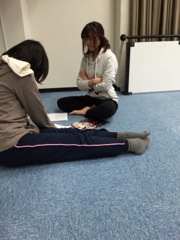

ドーモ、最近スキあらば図書室に籠りがちの二回生ジミーです。

　 11月も終わりに差し掛かり、師匠が走り出そうとクラウチングスタートを決め込んでいる今日この頃皆様は如何お過ごしでしょうか？

　 新人発表公演も残すところほぼ一ヶ月となってまいりました。一回生達は台本を外し、「どう読めばいい感じに伝わるのか」とか「ここではどういう風に動くべきか」とか各々の課題に対して真剣に向き合っています。

　 二回生の僕はというと…セリフが入ってなくて後輩同期からバッシングを浴びました(-\_-;)
「台本締め切り終わってるぞ！」
いやぁ～頑張らないと(汗)

　 写真は去年の新人発表公演で演出を務めた二回生のパピーとキャンパス祭公演の前座演出を務めた一回生、ジャンヌの二人。演出経験のある二人は真剣に台本とにらめっこしてます。　

　 あと約一ヶ月。果たして僕はセリフを覚えることが出来るのか？(笑)ではまた！
絶対見るナリよ

　 　 p.s.神戸大学の自由劇場さんが公演の宣伝に来てくださいました。台本は惑星ピスタチオの『破壊ランナー』大好きな台本なので凄く見に行きたい！！「スタンプペッタン♪スタンプペッタン♪」
