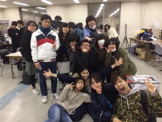

おはこんばにちは。ブログめちゃくちゃ久々に書きます。2回生の大和です(＊´∀｀)

稽古もいよいよ終盤。私は今回スタッフとして関わっているのですが、稽古を見ていると役者のみんなの顔が引き締まってきているように思います。

"癖"ってなかなか難儀なものですよね。
演技においては完全に目の上のたんこぶですが、
自分が今まで20年近く生きてきた中でついた癖を、すぐ直すというのもなかなか至難の技。
『無くて七癖、有って四十八癖』
なんとも難しいものです。

今日明日から格段に冷え込むそうです。
余談ですが私は一昨日生まれて初めてヒートテックなるものを着用しました。
噂通り暖かいですね。
皆さんも風邪を引かないよう、暖かくしてお過ごしください。
そして是非、25と26はWAMホールへ！

以上！
一度考え込むと右手で髪の毛を引っ張る癖のある大和でした()
