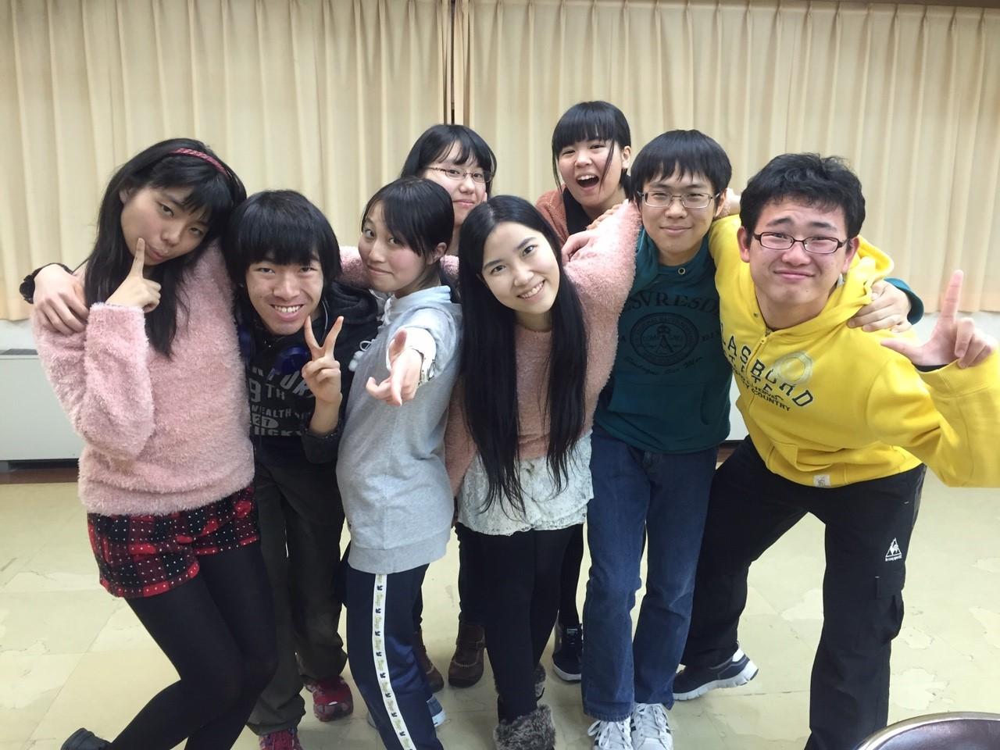

冬空に雨はやはり寒いですね。
雨が靴にしみこんで靴下がやられた会長です。

今日は新発最終稽古でしたね。
明日からは小屋入りです。

全員エチュードをした時、最後のシーン回しと言われた時、残り稽古日数が0日と伝えられた時、今日は様々なところで終わりを感じました。

今思い返せば新発期間は2ヶ月近くもあったんですね。今日に至るまでが早すぎて不思議な感覚です。
日が暮れるのもすっかり早くなり、基礎稽古の時に眺める景色が夕焼けから夜景に変わったのもいつのことでしたか。

長く短く遅く早かった新発。終わりは何にでも付いてくるはずなのに何時までもたっても慣れませんね。

と、しみじみしていても仕方ないので後ろを見すぎず、先を見すぎず、しっかりと目の前を見ようと思います。まずは仕込みです、初大道具チーフとしての大舞台、最高で最高に最高な舞台を作ってみせますよ！

しっかりと暖かい布団で英気を養う会長より、今日のブログでした。
