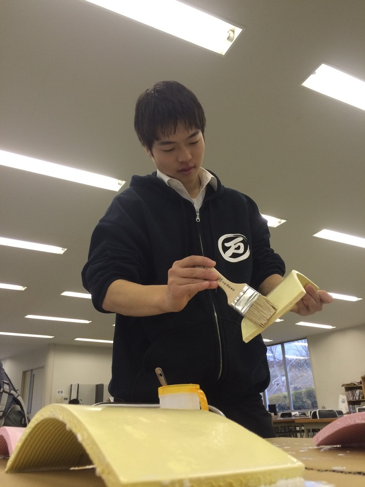

blog書くのは約３ヶ月ぶりです。らむです。
今年のおみくじは大吉でした。

厚着が嫌いなので、
薄くても超暖かい服とかないかなぁ と頭の隅の隅の隅の方でちょっと思いながらも元気に稽古しました。
気温は僕の体感時計だと多分２度位だと思います。(適当)

今回の卒業公演は殺陣がたっっっぷり！
ということで今日は基礎稽古に殺陣練も組み込みながら。。

本日のメインは やられ方 です。
グーで殴られたら、刀で斬られたら、腹を蹴られたら どうなるのか 先輩方や同期のアルゴが手取り足取り教えてくれました！
今までの人生で 殴られる事もあまりなく、ましてや、刃物で刺された 斬られた経験が貧弱なものなので 頭も体もフル回転させて取り組みました。

斬る側と斬られる側、両方ともしっかりと練習して、最高の一手をお見せ出来る様にがんばります！

写真は小道具チーフのちゃーりーさん。
何を作っているのでしょうか？
黄色とピンク…美味しそうです！笑
完成するのをワクワクしながら待ってます！

スタッフも役者も演出も。
後輩も先輩も同期も。

万絵巻の総力尽くした最高の公演！
是非ともご来場下さい！
お待ちしております！
