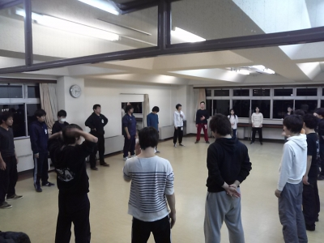

寒さが肌をさす今日このごろでございますが、皆様如何御過ごしでしょうか。

暖冬とはなんだったのか、夜に稽古が多いということもあり帰り道がめっちゃ寒いです。このblogをご覧になられている皆様、そして劇団員の健康を心より願います。

改めましてこんにちは！
今回のblog担当は三回生のあきらです。おそらく新歓公演以来振りですお久しぶりです。
この卒業公演では私は音響のオペ、効果音担当の一人です。殺陣とか陰陽術とかその他たくさんの音を鳴らしますよ！そして開演前に客席後ろをチラッと見ていただくと緊張でカチコチな私がいると思います(笑)

そうそう、テスト休みや仕込みの日を除くともうあと25日切っているんですね。音集めたり鳴らす練習とかしないと、というのも少なからずはあるのですが……今の四回生と公演に関わるのもあとそれくらいなんだと思うとちょっと寂しかったり。
でもそんなことは今は忘れて毎日をめっちゃ楽しんでいきます！

そんなこんなで役者もスタッフも総力をあげてこの卒業公演に臨んでいます。ぜひ観に来てください！
P.S 写真は何気ない稽古場風景、卒公なだけあって人数が多く円も大きくなりますね！
P.S その2 今日は通しですね、頑張りましょう！

以下公演情報です！

◇　演目
関西大学劇団万絵巻2015年度卒業公演
「野獣郎見参！」

作：中島かずき
改訂・演出：アイル

◇　日時
2016年 2月 26（金）1st18:30～
　 　 27（土）2nd14:00～ ／ 3rd18:30～
　 　 28（日）4th12:00～ ／ 5th16:30～

※受付開始は上演時間の30分前からとなります。
※上演時間は約120分を予定しています。

◇　料金
学生
　　　前売:1000円
　　　当日:1200円
一般
　　　前売:1200円
　　　当日:1400円
三人割
　　　学生・一般、関係なく
　　　三人同時予約で2400円

※学生の方は当日学生証をお持ちください。
※三人割をご利用の方は必ず三人揃ってご来場ください。
※三人割をご利用の方で当日三人揃わなかった場合は学生前売か一般前売の予約とさせていただきます。

◇ あらすじ

――満月の夜、妖は蠢く。

　都を護る晴明塚は応仁の乱により崩れ、京は妖怪の頭領・道満王と魑魅魍魎が跋扈する魔都となっていた。

　その妖どもを狩る男、不死身の物怪野獣郎。

　金を目当てに妖を狩る最中、
　かつての妻・美泥とその夫・芥蛮嶽に出会う。

　蛮嶽は安倍晴明が残した永遠の命を得る秘法を探していた。その名も『晴明蟲』。

　果たして晴明蟲の真の力とは――。

呪われし京の都を、野獣郎が駆け抜ける！

◇　キャスト
物怪野獣郎：西村友志
芥蛮嶽 ：茶髪
美泥：散葉
穿ちの錐蔵：グルメ
左前の甚五：じょー
北の宮の眠り姫(梨花姫)：ジャンヌ
安倍西門：高橋=Kathleen...
猿噛：入江文哉
赤松為麿:ジミー
細川虎継：らむ
雪目：アイル
道満王：ホロ
婆娑羅鬼：チャーリー
荊鬼：冬花
独言鬼：じじ六茶
陰面羅鬼：アルゴ
葛鬼：ほのか
風鏡：高橋=Kathleen...
渋毒柿右衛門：アルゴ
一刺し蜂介：夜王
あぶくの蟹兵衞：会長
いがいが栗満太：はちを
うすらの臼六：出雲大社
女官　松、石妖：きなこ
女官　竹、青鷺火：あおい
女官　梅、空穂：みりん
縊鬼：ドクトル
夜釜焚：パズー
魑魅：大和
山姫：ベル
煙々羅：如月
侍大将：マキ
足軽：インテグラル

◇ スタッフ
舞台監督：ナスカ
舞台美術：まりぞん
大道具：冬花
小道具：チャーリー
音響：高橋=Kathleen...
照明：a---min
衣装：あみなつの
広報：ゆっきー
制作：ゆっきー
殺陣：西村友志
振付：散葉
PV：もーりん

◇　会場
大阪市立芸術創造館

◇　アクセス
・地下鉄谷町線「千林大宮」駅下車
　4番出口より南西へ徒歩10分
・京阪「森小路」駅下車
　西出口より西へ徒歩10分
・大阪駅前より市バス
　幹83号系統「守口車庫前」行 または
　幹78号系統「花博記念公園北口」行
　約40分「旭区役所前」下車すぐ
・地下有料駐車場あり

◇　予約方法
https://ticket.corich.jp/apply/71152/

◇　お問い合わせ
HP：http://www.yoroweb.com
Twitter：@Yoroduwemaki
MAIL：information@yoroweb.com
TEL：090-8165-9308（トウノ）
