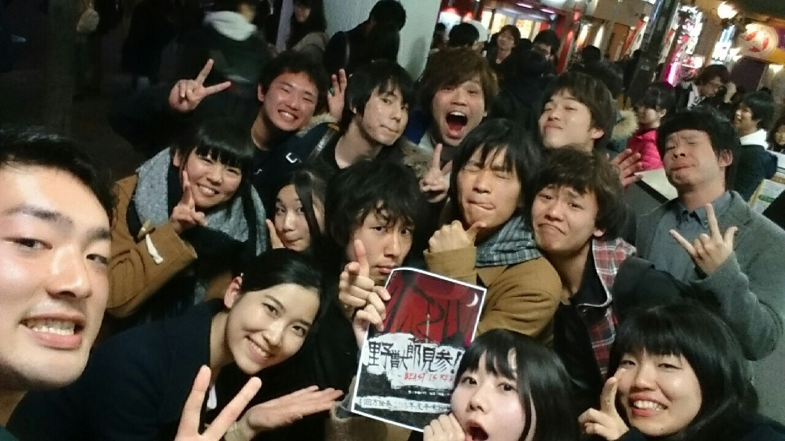

どーもみなさん、お早うございますこんにちはこんばんは。
三回生のアルゴです 。写真の1番左のやつが俺です

今回は、万絵巻それかん参加！というブログです。
それかんというのは、関西の学生劇団が一同に会してあれやこれやしゃべったり交流したりするのですが、いやー今回は人数が多かった。総勢80人ですって。すごいですねーまあすごい。15くらいの劇団が参加したんじゃないかなー。でですね、今回は呼びかけのかいあって、万からも14人と史上最多人数が参加してくれて、幹事の自分からしたらもう感謝感激雨嵐です！その分宣伝力にもつながりますからね！ゲヘヘ
こういう場に参加してよく思うのは、知られるってことはめっちゃ大切だなってことですねー。
どこの劇団がどんなお芝居するのか、何をやるのか、どんな人が参加してるのか、それを知ってると知らないとではやっぱり見に行こう！て思う気力が変わってきますね。渉外担当の自分が言っちゃっていいのか！って書きながらに思いましたけどまあいいや。
やっぱり知りあいがいると見に行きたくなる。有名な劇団の台本だと見に行きたくなる。有名な人が参加してると見に行きたくなる。そういうもんですねぇ
今回のそれかんで、万の14人が、他団体の人と知り合いになってくれたので、その分は観劇意欲があがってくれるといいな。
それと同時に、劇団万絵巻ってものを参加した人だけじゃなく、いろんな人に知ってもらえたらいいな。

劇団万絵巻、公演やります。
演目は、劇団☆新感線の中島かずき脚本
『野獣郎見参！』

面白い人たちが面白いものを作っています。
それかんに参加した皆様も、参加してない皆様も、はたまた学生以外の皆様も楽しめる作品です。
是非是非、見に来てください。
アルゴでした。
