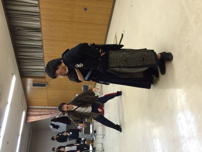

おはこんにちこんばんは、最近文才が欲しいと切実に思う1回生のDJかおりです。
さっそく本日の活動報告をば…

今日は朝から仕込み説明会が行われました。
舞台監督さんの進行のもと全員でタイムスケジュール等を確認し、本番に向けて着々と準備を進めている次第でございます。
やはり仕込み説明会をすると、ああもうすぐ小屋入りなんだな、本番なんだな…という思いが湧き上がってきて、不安だったり楽しみだったり複雑な心境になると同時に身が引き締まりますね。

そしてそんな仕込み説明会のあとは総会を挟み夜まで稽古も行いました。
私は今回音響でSEオペを担当させていただいているのですが、やはり役者さんの動きに合わせて音を鳴らすのは難しいです。でも、今回の公演では殺陣があるので役者さんと一緒に練習する時間が多く、私個人としてはいろんな方と関わることができ、かつカッコいい殺陣が見れるので嬉しくもあります。
もちろん、今回の卒公では殺陣以外にもたくさんの見所がありますよ！
役者のみならず、どの役職のスタッフも全力を注いでいる所存であります！
どれくらいすごいかって？それは本番を観てのお楽しみ…
2月26日～28日は、ぜひ大阪市立芸術創造館まで足を運んでいただければと思います！
