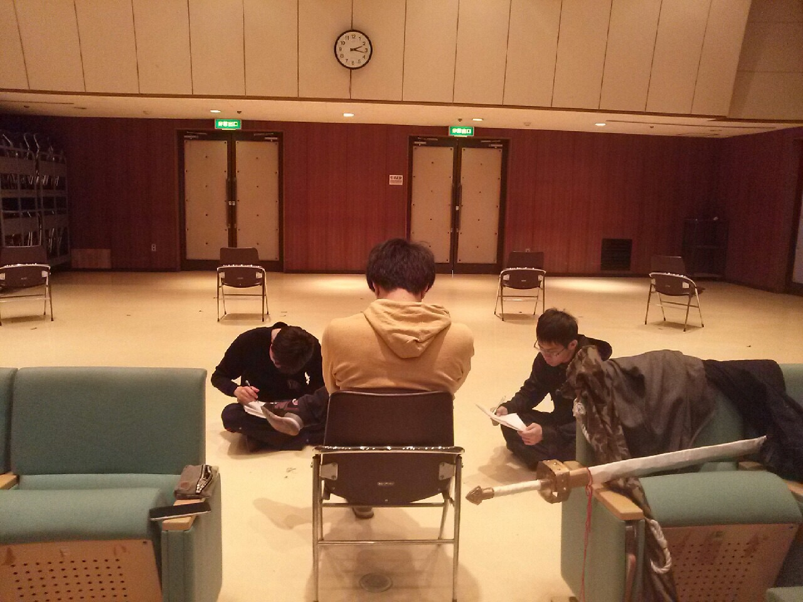

春の面影が感じられる今日このごろ。

こんにちは。

今回照明チーフを務めさせていただくあおいです。

私は照明をやりたいと思いこの万絵巻に入り、いつか照明チーフになって自らの手で舞台に明かりを灯したいと思っていました。

なので念願叶ったという訳です。

さて、今日は小屋見学に行って参りました。

照明機材を前に心の中でテンションが上がっていたという話はさておき、実際に機材を見て実感が湧いてきました。

私は一年前の新歓は客席に座っていたわけですが、照明の素晴らしさに感嘆したことを今でも覚えております。

観に来て下さる新入生の皆様にその気持ちが味わっていただけるよう、全力で頑張って参ります。

ちなみに写真は今日の稽古風景。

演出さんの話を真摯に聞いているようです。

きっと面白い作品となるのではないでしょうか？

入学してからからもう少しで1年。

ちょうど1年前は引越しの準備で忙しかった記憶があります。

自分がさん付けで呼ばれる日が来るのかと思うと不思議な気持ちです。

時の流れとは早いものですね。
