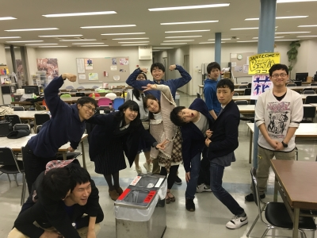

お疲れ様です！！
今回、舞台監督をさせていただきます、新3回生の大和です！(＊´∀｀)
写真は稽古後の写真！長時間の話し合いの後だというのに、みんな変わらず元気で楽しそうです！！

年月は早いもので。
ついこの間入ったつもりだった万絵巻ももう2年が過ぎ、あっという間に3回生…
先々月卒業された、自分たちが入った時の3回生の方々を思い出すと身震いが止まりませんが…(´・ω・｀)
心機一転！！！この度、スキルアップを目指して、初舞台監督に挑みます！！

そして、今日は仕込み説明会でした！
【仕込み説明会】というのは、
「役者が演じてお客様がたに見ていただく舞台そのものを作る(、これを通称「仕込む」といいますがその)上で、スタッフ全員と全体的な仕込み手順や当日の行動の共有をし、各役職でチーフが詳しく仕込む際の手順を説明する会議」
のことです！
これはお客様に見ていただくためにとっても必要なこと！
どれだけ役者が素晴らしい演技をして、演出が素晴らしい演出をつけ、素晴らしい音響・照明のプランを立て、「見たい」と集まってくださるお客様がいても、
全体で共有できてないことがあって、みんながバラバラに動き、その舞台がちゃんと作られていなければ、意味がなくなってしまうのです。

この仕込み説明会をまとめるのも、舞台監督の仕事。
スタッフ全体を統括すべき舞台監督にとって、絶対に忘れてはいけないイベントです！
とっても緊張しましたが、私なりのベストは尽くせたかな…？と思います(^ω^;)

舞台監督。
公演全体、そして特にスタッフ業務においての最高責任者。
責任感が鍛えられ、
全役職のことを知れて、
全員と触れ合うことができ、
なんといってもやりがいが満載！！

このブログを見ている新入生！
君も、一公演のトップに立ってみませんか？(｀・ω・´)

私も含め、役者スタッフ一丸となって、最高の舞台をお見せします！
4月15日(金)と16日(土)、C棟スタジオでお待ちしております(＊´∀｀)

以上！
緊張すると息継ぎせずマシンガントークになってしまう、大和でした！！

とっぴんぱらりのぷぅ。
