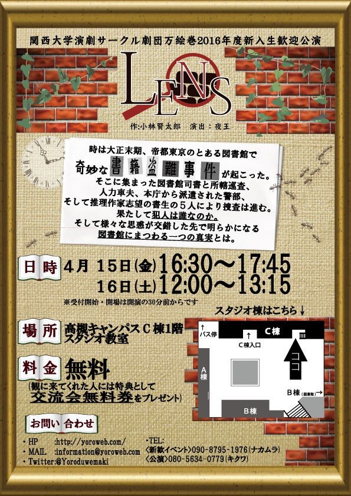

おはこんばんちは！
3回生になった如月です！！

昨日は万絵巻新歓イベントのひとつ、お菓子パーティーがありました♪
来てくれた新入生のみなさんありがとうございました！
はやく万に1回生が入ってくる日が来ないかなぁと待ちどおしくなります。

そんな中、本公演の役者陣は裏で稽古をしておりました。
本番目前、大詰めです…！
演劇に興味がある人も、なんとなーく面白いサークルを探している人も、ぜひぜひ今週末観にきてくださいね♪

公演情報↓↓
【演目】
関西大学演劇サークル劇団万絵巻2016年度新入生歓迎公演「LENS」

作:小林賢太郎
演出：夜王

【あらすじ】
時は大正末期、帝都東京のとある図書館で奇妙な書籍盗難事件が起こった。
そこに集まった図書館司書と所轄巡査、人力車夫、本庁から派遣された警部、そして推理作家志望の書生の5人により捜査は進む。
果たして犯人は誰なのか。そして様々な思惑が交錯した先で明らかになる図書館にまつわる一つの真実とは。

【日時】
4月15日(金)
①16:30～17:45
4月16日(土)
②12:00～13:15
※受付開始・開場は開演の30分前からです

【場所】
高槻キャンパスC棟1階スタジオ教室

【料金】
無料(観に来てくれた人には特典として交流会無料券をプレゼント)

【キャスト】
天城　茎太郎 じょー
駒形　玲子 如月みさき
春日　桜太 ドクトル
犬養　梅衛門 会長
愛宕屋駿菊 ジミー

【スタッフ】
舞台監督：大和
大道具：会長
小道具：パズー
舞台美術：ほのか
音響：スギちゃん
照明：蛍河葵
衣装：ぱぴー
広報：もっさん
制作：わじー
