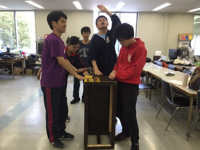

お疲れ様です、おはこんにちこんばんは！

ＴＣ祭公演では

衣装チーフ と 役者

をさせて頂きます、２回生のベルです！

役者としてはっちゃけるのみならず、

自らの手で自分の分も含む衣装を考える…

なんて新鮮でもなんだか不思議な感覚。

手作りのモノも幾つもありますよ、

頑張ります宜しくお願いします！

今日は少し日が空いての学校稽古でした！

早くシーン回しがしたくウズウズでした。

しかしその前に演出さん曰く

「体力をつけてほしい！」という事で、

あいうえお回しをしつつのランニング…！

元文化部の私にはかなぁありの労働、

ぶっ倒れちゃうかと思いました。

でも、これも面白楽しい公演にする為！

汗水垂らして励むべし、です！

まあとにもかくにも今は台詞、

覚えます尚且つ舞台からはみ出ません！

１ヶ月間の奮闘の末是非お確かめ下さい！

また、今公演はなんと２本だて！

１回生のみによる前座も御座います。

彼・彼女達を近くで見守っている分尚更、

どんな作品が出来上がるか楽しみです！

写真は先輩方とのセッションです。

私はアクセントとして時折奏でました。

自然と始まってゆく可笑しなノリ。

いやあうん、愛しくって堪りませんね。

その背中、追いかけます。

*   0

*   [2013graduation](./?cid=47073)
*   [comments(0)](about:blank/?eid=1108976#comments)
*   [trackbacks(0)](about:blank/?eid=1108976#trackback)
