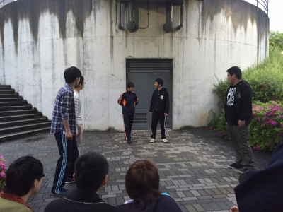

こんにちは、いかがお過ごしでしょうか。今日は雨の中スーツのあきらです、4回生になりました。びっくりですね！
今回のTC公演では音響スタッフをさせていただいています。
唐突にblog担当に任命されましたが、寝落ちしてしまい今に至ります。よくある話ではありますが反省です。

さて！話を切り替えて、昨日も雨でしたが万絵巻はうるさく、いえ元気に活動していました！
写真は雨に濡れないため生協に行くための橋の下でエチュードしている場面ですね。遠いですがオレンジジャージの会長が悪い顔してますね(笑)
一回生も自分から出てくるようになって楽しくなってきました。

シーン練始まってからはOPやったりわいわいがやがやしたりしてました。OP見るのはやはり楽しいですね！本番をお楽しみに！

昨日の稽古は役者だけでなく、衣装の小物を作っている人やプランどうしよーってあたふたしている人たち、一回生の稽古を見る人もいました。そして演出。
彼らも去年は前座組んでやってたんだなー、もちろん3,4回生も前回TC公演の笑われガスターから一年近く、色々あったなーと時の流れを感じました。

そうゆうことで昨日突然再開したキーワード企画、私からは『成長』とさせていただきます。
去年とは一回りも二回りも大きくなった皆を見に、是非TC公演を観に来てくださいね！
