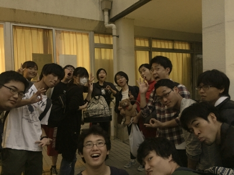

こんばんは！
今日のブログはジャンヌがお届けします！
2回目です。わくわく。

今日はジャンヌ的最果てクロニクルの見どころをご紹介したいと思います！

まず役者。
1回生から4回生まで計16人の役者で現在劇を作っています。
大人数の役者が舞台に立つ場面も多く、まるで昔の西洋絵画をみている気分になることでしょう…！(？)
わいわいしたり、真剣になったりと、お客さんも楽しんでいただけるかと思います！
後半になるにつれてどんどん明らかになる事実に目が離せません！

そしてスタッフ。
個人的には音響さんの曲選が素敵だなぁと感じています。
稽古場できいてるとテンションあがるものばかりです。かっこいいです。
また、私は広報をしているのですが、今回初めてビラの作成を担当させていただきました。
ずっと作ってみたかったのでとてもやりがいがありました。
ビラをみて少しでも興味をもっていただければ幸いです！

本番まであと2週間。最後まで走り抜きます！

写真は今日の稽古おわりのみなさんです。
なんのポーズをしているのでしょうか。
オッケー？お金？それとも…q(&#175;・ω・&#175;)b
