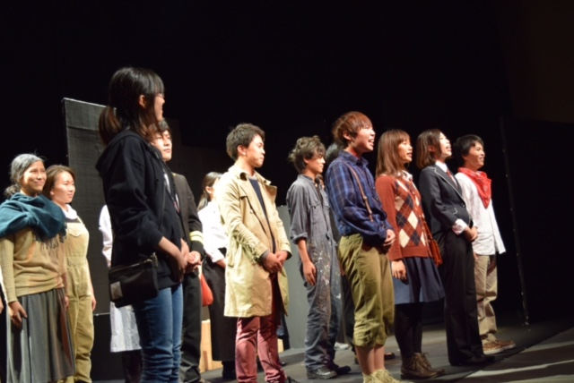

おつかれさまです。秋公演演出です。

何度公演を重ねても忙しいと思うのも辛いともしんどいとも思うのも、楽しい、まだやりたいと思うのも一瞬ですね。あっというまにあと2日となってしまいました。

思い返せば、私は皆に引っ張ってもらってばかりだったなと思います。頼りない部分を見せてはもっと上手くやりたい、無駄に時間を使ってしまった。見ている点が間違っていたのではないか、そんなことを帰っては布団の中で考えてました。

それでもこうやって本番を迎えられるのは頼りになって楽しく演じてくれる役者さん、しっかり意見を伝えてくれる演補、厳しすぎる優しさをもつ舞台監督、私の要望以上のことを実現してくれるスタッフさんがいてくれたお陰であって、誰か欠けては何もできませんでした。

この秋公演に関わった全ての方々に感謝の気持ちでいっぱいです。

本番については何も心配していません。スタッフさんにはできる限りの最高のことをしてもらい準備は完璧ですし、あとは役者達ががそれを生かして積み上げたものを魅せてくれるに違いないと思っています。約一ヶ月半ではありますが、万絵巻の一公演として胸をはれるものをつくれたと感じてます。

15,16と本番2日間全力を尽くし切り良いものを見せたいと思います。皆様のご来場をお待ちしております！

