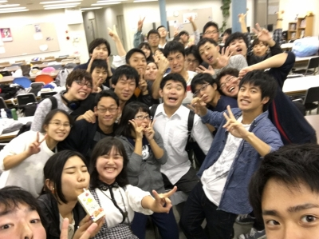

４回生のらむです。
卒公はじまりました、はじまってしまいました、はじまっちゃいました！
卒公が始まってから なんか妙にソワソワして落ち着かないです…。
楽しみという気持ちは勿論。
最後の公演ということでの はりきり、寂しさ…。
んー！感慨深い！

４年間 培って来たことを
自分なりに何か後輩に残せていきたいです。 もちろん後輩にカッコいい後ろ姿 も見せたい！(笑)

そんなこんなで 卒業公演、本日選考ラスト日でした。
泣いても笑っても今日でラスト！みんな、元気に手をあげ、声を張上げ、自分を思いっきりアピールしてました！
卒業公演の度に思うのですが、人数がとても多いですね！
特に今年は30人超えの超大所帯！見渡すだけでも圧巻です(笑)
この人数の多さは万絵巻の公演の魅力の１つのだと思ってます！
人数の多さを活かした圧巻の舞台、楽しみにしててくださいね(^^)

思いっきり楽しんでいきます！

以上、
最近ゴボウ茶飲んでる らむでした。
不味いです(笑)
