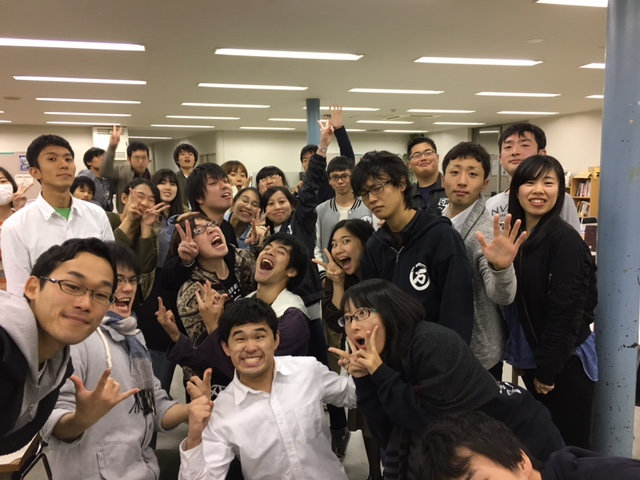

お久しぶりです、うみです。
卒業公演では衣装チーフと役者をしています。
最後に衣装チーフをさせて貰えるのは有難い限りです。
小道具は前回公演で卒業しました。

…その時に思ったのですが、卒業って寂しい事ですね。
もう二度とその面子で取り組むことが出来ないんだから。
でも今思うのが、そんなに悲観することもないんだってこと。
卒業はさよならじゃなくてまたねなんだって。
今まさに、うちで小道具合宿をしているんです。
卒業しても、また会える。会ったら楽しく喋れる！！

…ということで(?)卒業公演という事で、ご期待に添えられるように頑張ります。

最後に取り組む脚本は、松尾スズキのラストフラワーズ。
私たち20期生最後の公演、是非お越し下さい！
