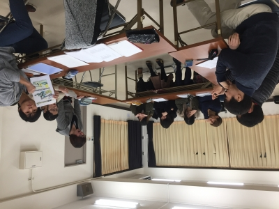

お疲れさまです。
2回生のジャンヌです。

今日から新発の稽古が再開しました！
久しぶりの今日は台本について話し合うブレストでした。
今回の台本「恋人としては無理」は奥が深いなーと読むたびに思います。
1回生から色々な意見が出ていて頼もしく感じました！
細かいネタや楽しくなるテンポ満載です。

前半にブレストをして、後半は残った少人数で色々な話をしました。
役作りや基礎練のダメだしについてだったり、今回の劇についてだったり、濃密な時間を過ごせました。
あとはやることは決してないだろうアフタートークの練習をみんなでしました。
とっても楽しかったです笑

私は今回演出補佐をさせていただいていますが、演出の小田バーグ君は自分も楽しく周りも楽しくさせるような稽古場をつくっていてすごいなと感心します。
他の1回生も自分の役について真剣に考えたり、自ら他の人に意見をきいたりしていて尊敬します。
少しでも1回生の力になれるよう私もがんばろうと思えた1日でした(」・ω・)」

万絵巻23期生が主体となって行う新人発表公演、ぜひお越しください！
