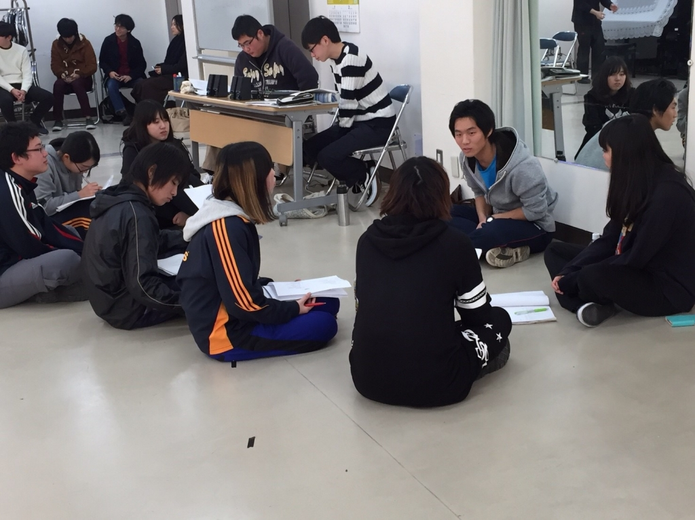

こんばんは、時雨です

本日は一日休みを経ての稽古でした
基礎練もそこそこにひたすらシーン回しシーン回し！
うーんいよいよ本番が近いなぁと実感します

今日はひたすらにシーン回しをしてひたすらに話し合いを重ねました
一度回してみて、話し合いをして、改善をしていく
出来なかったことが出来たり演出に褒められるとやはり「ヨッシャ！！」とテンションも上がりますね

更に今日は４回生3回生の先輩方も稽古場に足を運んでくださいましたわーい！
先輩方から見て少しでも成長出来てたらいいなぁと思う今日この頃……いや、成長します頑張ります(笑)

試行錯誤を重ねた新人発表公演は2/25と26にワムホールにて！是非お越しください！

(写真は自分のプリン頭すげぇなと思った一枚)
