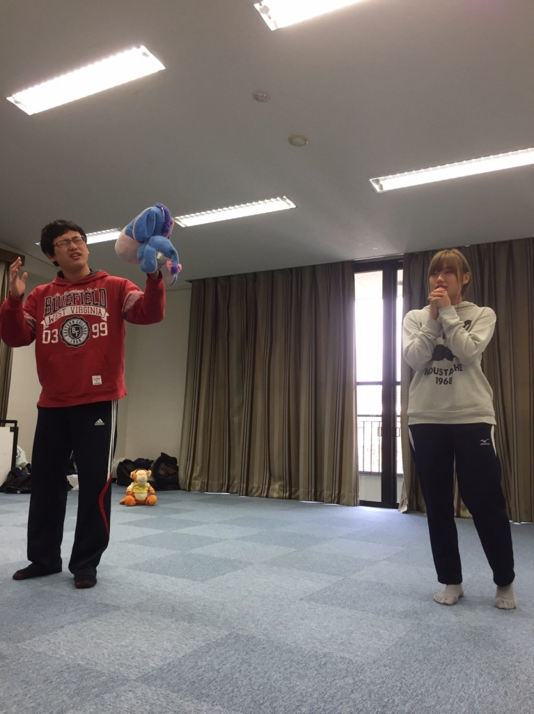

こんにちわー

パズーです！！

最近ブログがなかったですね。

はい、僕のせいです。すいません。

一つ目はもうでましたが、

なんと！！

本日のブログは豪華3本立て！！

そのうち2本パズーの回とさせて頂きます。

そんなこんなで書いていきます。

自分ってバカだと思うんですが、基礎練って大好きなんですよ。

なんでも基礎がないと始められないと思うのもあるのですが、その後自分の成長を一番感じられ見せられるのは基礎練だと思います。

声量であったり、身体のキレであったり

まだまだ先輩や同期達に負けてるなーと思うところもあるんですが、塵も積もれば山となるそういう心持ちでこれからも頑張っていきます。

本番までもう少し、

この稽古場の元気で楽しい空気をお客さんに届け、面白かった！その一言を聞くために、

まだまだできることいっぱいあるので、自主練習で感情面やネタをどんどん考えてお客さんに笑ってもらいたいですね。

iPhoneから送信
