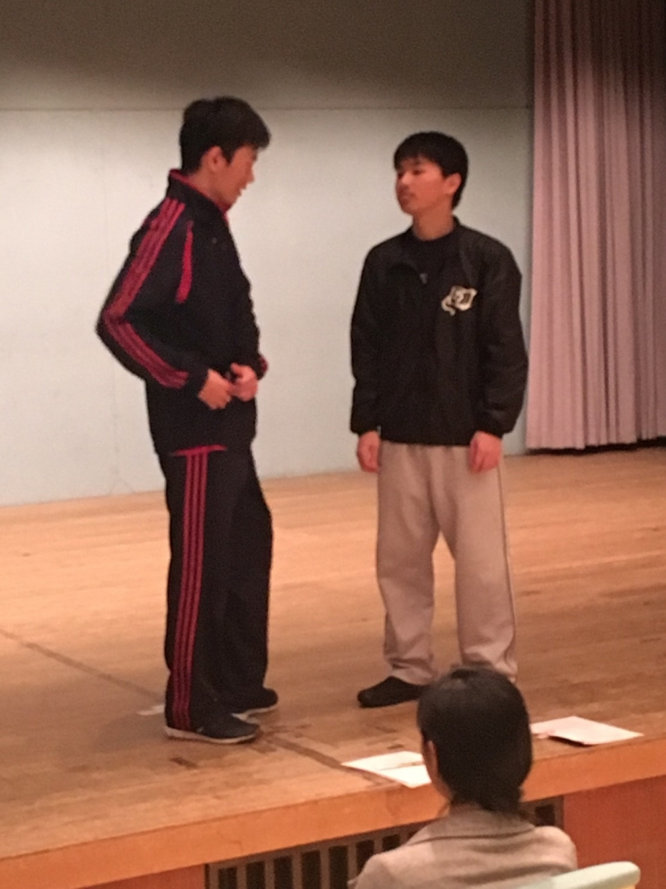

おはこんにちこんばんは、流離いのベルです！

"さすらい"と一度言ってみたかったのですが、

こんなややこしい漢字書くんですね…。

今日は衣装合わせがありました！

私担当の作り物2つは"あの"雰囲気漂う衣装。

少し曲者、でも着こなしちゃう"かれ"は凄い！

そして役者が集合し並ぶと感動しますね。

舞台に立ち光を浴び音が流れるとどうなるの？

想像するだけで不審者の如くニヤつきます。

その後はホワイトボードを使ってのブレスト→シーン回し！

今日初めてガッツリ稽古をみたのですが、

同期が演出・役者として引っ張る姿、

後輩が負けじと食らい付く姿。

よかですね。すごくよかですね。

胸にカイロを貼った様な感覚になります。

沢山の時間と努力で作られる「演劇」。

本番には沢山の新入生に観て貰いたいし、

その為には私も昨年同様アツく声掛けますよ！

まだ日はありますが今から楽しみです！

写真は自主練習の様子です。

試行錯誤を経て変化していくのが面白い！

以上、鼻のデキモノと日々激戦中のベルでした！
��ω・)°⌒

※タイトルは気分で付けました。
