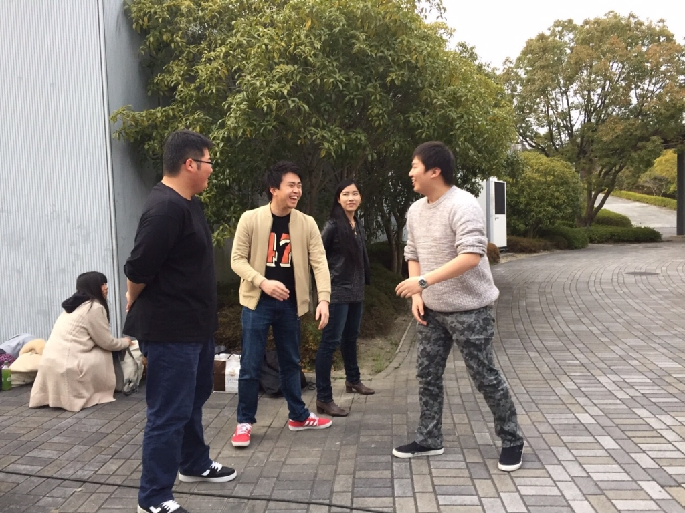

こんばんは！ジャンヌです。
ついに3回生になってしまいました。
時が経つのははやいもので、大学に入学したことがつい最近のように感じます。
一方で、目に触れるもの全てが新しかった当時に懐かしさも感じます。

さてさて、今日は最終通しでした！
衣装を来て、舞台も建て込んだ状態での通しで、着々と完成に近づいているなと思いました。
万絵巻では珍しい、オリジナル台本での公演です。
新入生の皆さんにはぜひぜひ観ていただきたい内容になってます！
気軽にお越しください(\*´ω｀\*)

そしてそして、本日稽古場には18期生のふろむさんとジュークさんにお越しいただきました！
寒い中ありがとうございました！！

写真は通し前のスタッフ陣です。楽しそうですね。
