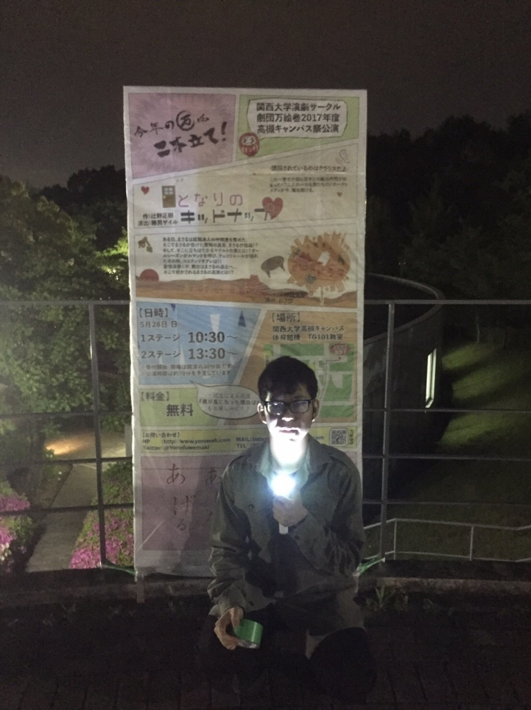

こんばんは。
今回衣装チーフをしてます、ふうちゃんです。
ブログではお久しぶりです。

さて、今日はわさび班・かつお班ともに通しがありました。
前回の通しは予定が合わず、今回初めて見たのですが……すっごく面白かったです！
どちらの班もそれぞれの良さがあり、色がありました。オムニバスだからこそ、台本・演出・役者による雰囲気の違いを感じる事が出来ると思います。
ここからどんどん演技等が磨かれていくと思うと、今から本番が楽しみになる。そんな通しでした。

ぜひ皆さん、5月28日には高槻キャンパスでそれぞれの劇を生で見てみて下さい。おすすめですよ！
