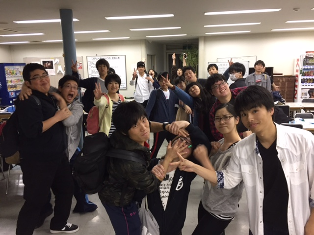

こんにちは！
今日の担当は3回生のあおいです。
3回生になって急に忙しくなり、
目まぐるしく日々が過ぎていくので焦りを感じております。

さて、今回は久々に役者をさせていただいております。
私が出演いたしますのはわさび演出の「就活浪人ホームドラマ」
とにかく笑う要素が散りばめられてるので、
楽しんでいただけるかと思います…！
関西人でなく、普段あまりお笑いを見ない自分は、
上手くボケたりつっこんだりできないので日々精進しております。

そして今日は1回生の子達が通し稽古をしていました。
今回の前座は様々なキャラクターが出てくるみたいですよ。
基礎練を一緒にしてるととっても若々しくて、
エネルギーを感じますね。

さて、題名である「力舞吼」
これはカープの今年のスローガンである
「力舞吼-Kabuku-」からとってます。
このスローガンには「カープらしく」熱く戦う
という気持ちが込められてるそうです。
私達も「万らしさ」全開な素敵な公演にすべく、
残り少ない稽古に励んで参りたいと思っております。
