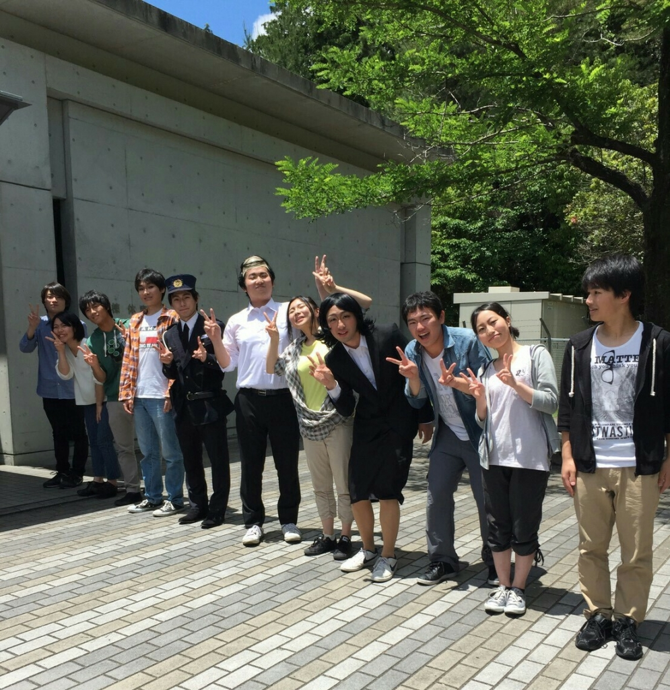

本公演にて制作チーフをさせていただきました3回生のドクトルです。

おかげさまで関西大学演劇サークル劇団万絵巻2017年度高槻キャンパス祭公演「となりのキッドナップ」、「就職浪人ホームドラマ」無事に公演終了となりました。
公演にご来場してくださったお客様、本当にありがとうございます。
劇団員を代表し、心よりお礼申し上げます。

さて、次回の万絵巻の公演ですが、10月に秋公演を予定しております。
これからも万絵巻一同精進してまいりますのでまたのお越し心よりお待ちしております！
