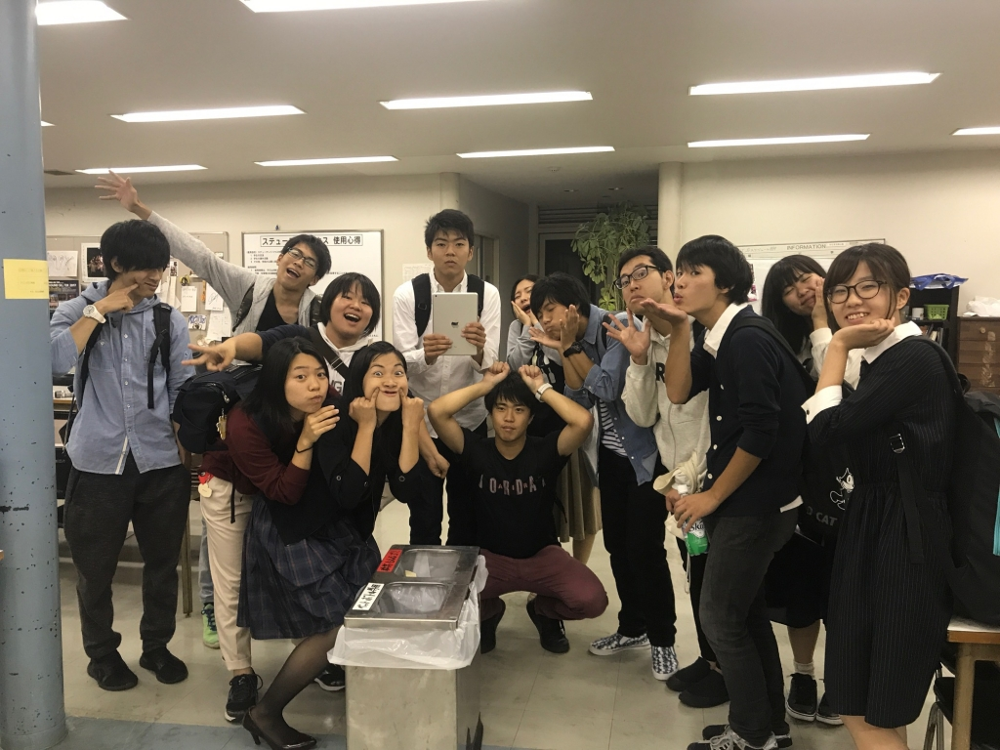

秋風が心地よい時節となりました、いかがお過ごしでしょうか。1回生マッシュです。秋公演では照明のサブオペをさせていただきます。

今日の稽古は、外で虫と演出さんの悲鳴が飛び交う中、オープニングやラストシーンのシーン回しを行いました。1回生はもちろん、上回生の方々も稽古を重ねる毎に上達している姿を見ると、本番はどんな素敵な舞台になるのかとドキドキします。私もこの舞台をより良くできるようにサブオペとして頑張りますので、皆様是非足をお運びください！

写真は皆さんにそれぞれ可愛いポーズをして頂きました。かわいいですね！

