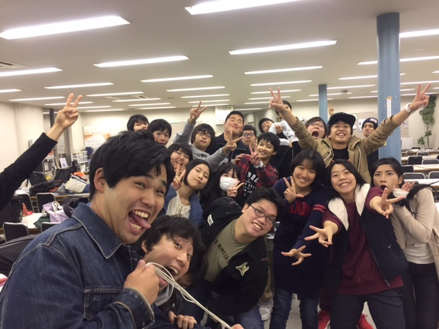

こんにちは。3回生のあおいです。
いやぁ、台風凄かったですね。
個人的には人生で2番目に強い台風でした。
こういう時に一人暮らしは怖いなって思います。

3度目の卒公、今年も役者をやらさせていただきます。一つ上の先輩方の卒公というのは感慨深いものがありますね。
力不足ながらも先輩方の晴れ舞台に少しでも華を添えることが出来るよう、全力で頑張ってまいります…！

電車遅延が相次ぐ中、そんな状況にも負けず今日も稽古でした。
基礎練では久々に落ち葉拾いエチュードをしました。名前が書いてあり戸惑う者、食べ物ラッシュ、カオスな空間が生まれることも…。
その後、明日の荒通しに向けて皆念入りに段取り確認をしていました。
こんな大人数で舞台に立つと考えるとわくわくしますね！

写真は稽古後にて
みんな元気ですね！
大人数で作り上げる卒業公演、ぜひ足をお運びください！

iPhoneから送信
