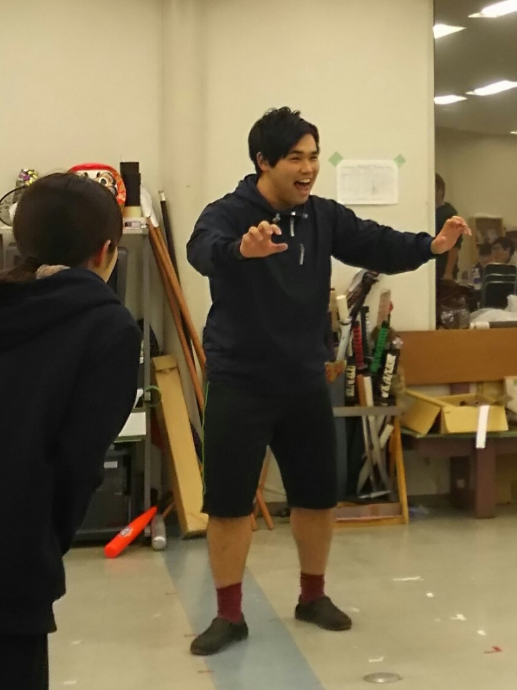

こんにちは。4回生のエーデルです。
今回の卒公では音響チーフを務めさせていただきます！
ほんとに4年間早かったなと思うばかりです。

さて、今日は急に寒くなりましたね。高槻キャンパスは天空の城ラピュタなので下界よりも心なしか寒いです。
そんな中でも今日の稽古では、10人以上が舞台上に出ているようなシーンをいくつか回していました。こういう大勢が出るような舞台も卒公ならではですね！

役者も多いですが、音響としてはやっぱりBGMやSEの数が他の公演と比べて半端ないですね(´ヮ｀;)
現在の予定ではBGMは40曲以上、SEは正確な数は分からないほどの予定です(笑)
舞台を盛り上げるべく頑張ります…！

写真はお題：マンモス狩りのエチュードをしている同期です。寒そうですね。氷河期が来たら生き残れるんでしょうか？
ではこのへんで。
