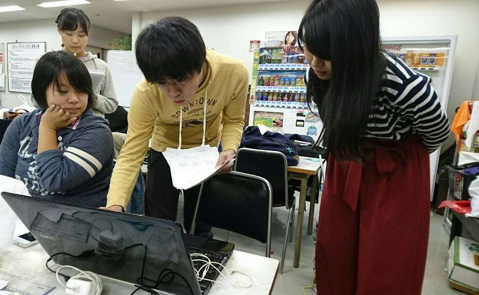

こんばんわです。
危うくブログを書き忘れるところでした。危ない危ない。

今日はいつもの基礎練などはお休み。その代わり、物語の理解を深めるために役者さんたちはブレストでした！
元気いっぱい手をあげて質問をする役者さんにしっかりと答えを返す演出さん。そして、それを聞きながらひたすら画用紙にニワトリを書く私。人によって物語の解釈が違うので聞いていておもしろいですよね！

あ、ニワトリで思い出しましたのでここで少し宣伝させていただきます！
11月4日（土）5日（日）に関西大学千里山キャンパスの統一祭で万絵巻が模擬店を出店します！
今回はチキンナゲットを売っています！ぜひぜひお越しください！

以上、ナタリーでした！
