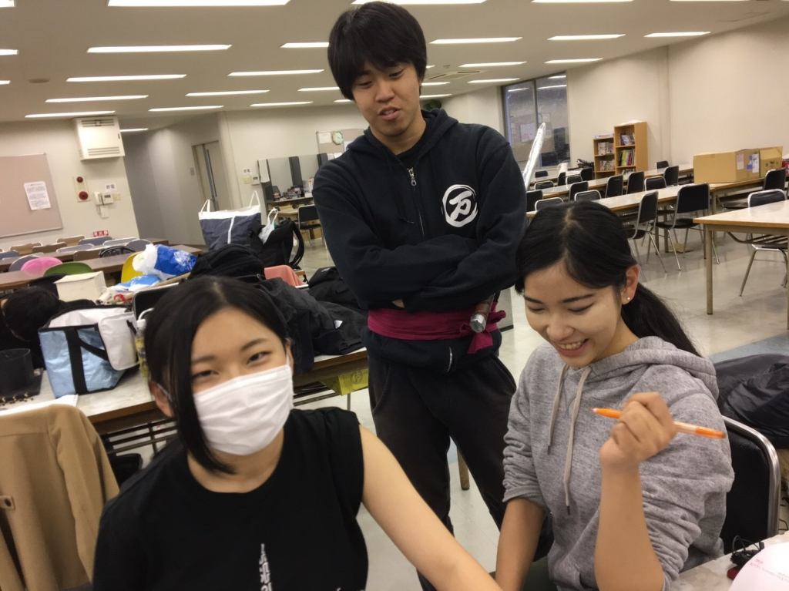

おつかれさまです

衣装チーフやらせてもらってます、4回生のパピーです！

きっと最後のブログとなります

昨日は寒空の下通しをやりました！前回と比べてぐんっと練度が上がっていました。残りも少ないですがまだまだどんどん良くなると思うと、期待が高まりますね。

大道具、照明と引き続き、衣装についてお伝えしようと思います。

今回は私が今まで先輩の背中を見てきて憧れるな、超えたいな、いいものを作りたいという思いを原動力にして経験したことできることを詰め込みました！

なので、衣装はかなり凝ってます！！演出さんと布を決めるために遠出してキャラに合うものをチョイスしたり、衣装の作りものも最大規模かなりの数です。

ここ最近の役者紹介での衣装を着こなす役者さんたちにおおっと思えてもらえたらとっても嬉しいです。ただ写真だけでは伝わらないものも、まだお見せしてない衣装も控えています！是非柄や細かいところにも注目してみてくださいね。

写真は万絵巻史上初めての衣装の試みをしてる図です。一体何をしているのか、12/8～10の芸術創造館にてお確かめ下さいねー！

それでは、失礼します。

