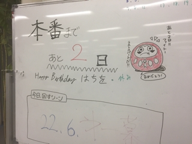

どうも最後最後と言われても実感がないほのかです！
『卒業』であること、きっと最後の舞台であること、口や文におこしてもまだこの公演が終わった次の日には次回公演な向けての稽古が始まる気がしてなりません。私は演劇を高校からやっていたので、実質7年間も没頭していたものに区切りがつくと考えるとしみじみしてしまいますね(\*´ー｀\*)

今回の演目『朧の森に棲む鬼』は、人の欲が主軸になっております。
欲は人間が生きていく中で必要不可欠であると言われているらしく、食欲、物欲、色欲、権力欲、金銭欲、名誉欲、睡眠欲…など人の深淵を覗いている物語でもあるのかなと私は思ってます。

いつもの万絵巻とは少し違ったシリアスめな演目ですが、それでも殺陣あり！ダンスあり！歌あり？？のエンターテイメントをお届け致します！！

私の7年間の集大成としてこれまでお世話になった方々に観てもらいたい思いと私たち万絵巻21期生の最後の力を見届けに来てください！そして、これからの万絵巻を背負う後輩たちの頑張り・輝きを観てください！
もう今週となってしまいました。ご予約も有難いことに埋まってきております！少しでも気になった方は是非ご予約して観に来てくださいませ(｀・∀・´)

2日後には小屋入りだ。 さ、明日はラスト稽古だぜ！！！
気合い入れるぞー！

p.s 今日は4回生・はちをの誕生日でした。おめでとうはちを！(本人本日不在)
