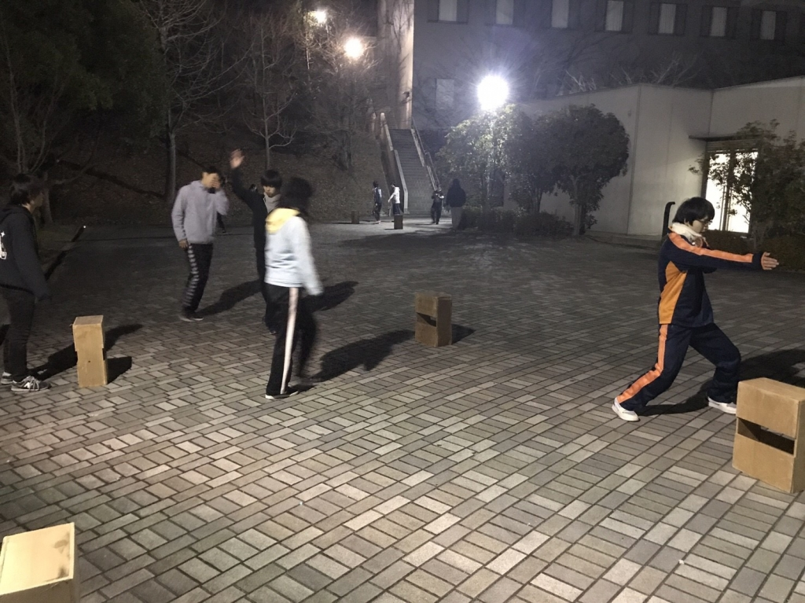

こんばんは！この度、新人発表公演で音響チーフをさせていただく電竜丸です！

今日は一日中基礎練でした！いつもとは違った練習をしたり、今までやってきた練習のやり方を再確認しました。いや～こうやって確認しながらやると基礎練ってこんなにも難しいものだったのかと思えてきますね！これから精進してもっともっと演劇が上手くなりたいですね！！

このブログを読んで「あれ、まだ公演に向けてシーン回しをしたりしないのかな？」なんて思っている人もいるかもしれないですが、演出曰く「基礎ができてないといい公演には出来ない」ということで今日は一日中基礎練をしました！まぁそれだけが原因ではなく演出が台本を改定していないというのもあるんですけどね……(￣▽￣;)

明日からそろそろ稽古が本格的に始まると思います！さぁ気を引き締めて頑張って行くぞー！！

以上、役者として出ないけど基礎練を頑張っている電竜丸でした！
