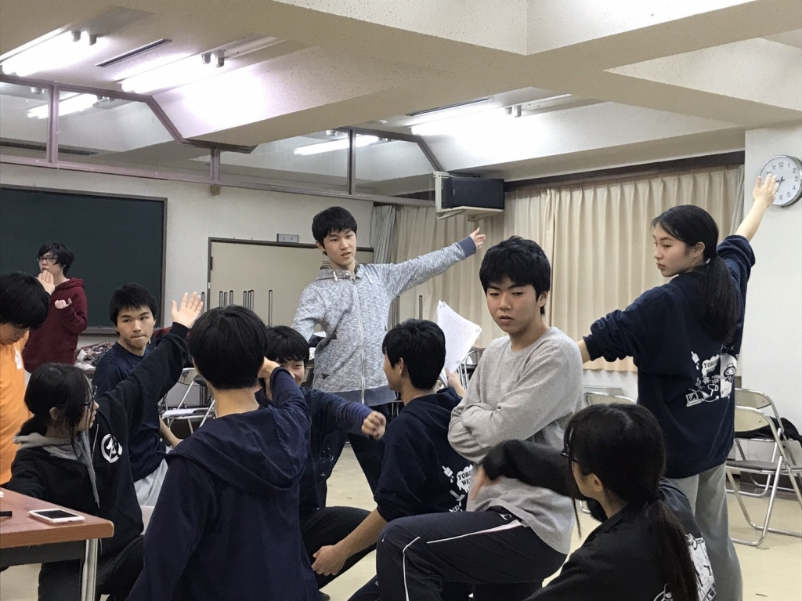

みんな～ 久しぶりブリブリブリリアント！！！

おっす！オラ みかど！たまげたなぁ～!

ラインのアカウントが消えるって

想像つかねぇくらい辛いだぁ～なぁ～

大切なものは、いつも失ってから

その価値に気づく

これ本当だぞぉ～

オラは、ラインのアカウントが消えてぇから

気づいただぁ

勉強料としては安いね！

グッジョブ！！！

ポジティブ！ ポジティブ！

ポジティブマインドコントロール！！！

シャ～キンッ！

ウィ、ウィ～～ン

ポジティブモードに移行
精神状態オールグリーン
シナプス計測、シンクロ率161%
ハーモニクス、全て正常値。
暴走ありません。

ヴィ～～ン ガシャーン！

どうもポジティブみかどです。

…………以上で茶番劇を終わります。

長々と失礼しました。

ここまで読んでくださってありがとうございます。

ここまで読んでくれた方には才能があります。

どうぞいいねしてください。

もしくはリツイートしてください。

伏してお願い申し上げマッシュ。

これから真剣にブログやります。

今日の稽古は、と～～ても楽しかったです！！！

常に笑っていました笑笑

ずっとふざけていました

でも、これは演出もしくは上回生への『信頼』や

仲間同士の『協調』があるからできることです、きっと。

まとめる人間を信頼しているからこそ、自分の

最大限を見せれる。そしてより稽古が充実する。

仲間同士で協調し合うからこそ、より稽古が充実

したものになる。

めちゃくちゃいいですね！

あとはこれをスタッフ人が、稽古ではない面

例えば、稽古場所の充実・小道具の早い納品などなど

で、どれだけサポートできるかが大切ですね。

舞台監督という立場は、特に大切だと思います。

稽古は外よりも室内の方がいい。

稽古は稽古場所がないとできない。

そしてそれを全て管理するのは舞台監督……

まとめる人間への信頼や仲間同士の協調よりも

もっと根幹の部分で稽古の充実性を左右しているのは

舞台監督だと思います。

こう考えると、とても大切で責任の重い立場ですね笑笑

手汗が出てきちゃいました笑笑

とてもやりがいがあります。

本番まであと2週間ちょっと…

みんなで駆け抜けます！
