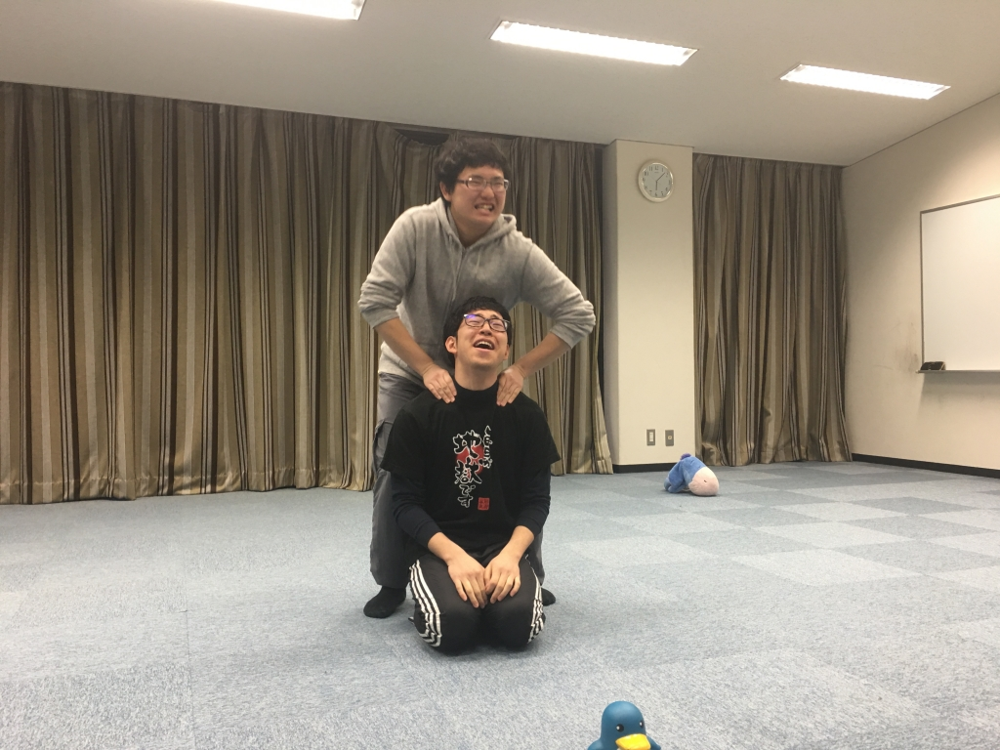

お疲れさまです！

本日のブログ担当はみかどです。

よろしくお願いします。

「パンを自分で作ってみたい！！！」

ここ数週間、ホームベーカリーを持っている友達か

ら話を聞いてるうちに、そういう野望が芽生えてき

ました。

… 決意しました………

よっし！買おう！！！

そして買いました、 ホームベーカリー笑笑

パンってもっと大きな機械で作るイメージがあった

んですが、案外コンパクトなものでできるんです

ね。

そして、コンパクトなだけでなく、とてもとても

簡単に作れるんですよ。

ただ材料を機械にぶち込むだけで、生種も作ってく

れるし、そのまま焼いてくれるし笑笑

レーズンを入れたら

レーズンパン！！！

紅茶の葉っぱを入れたら

紅茶パン！！！

生種を取り出してオーブンで焼いたら、もっともっ

と色んなパンが作れます

ベーグル！クロワッサン！！フランスパン！！！

すげぇ！ホームベーカリーすげぇ！！！

と、1人でテンションが上がっています笑笑

新歓についてです。

稽古楽しい！！！

ジェスチャーゲーム？的な稽古が増えたんですが、

それがとてもとても楽しいんですよ笑笑

今日の写真は休憩時間にもかかわらずボケツッコミ

エチュードをしているパズーさんとスキャ姐です。

とてもいいと思います。
