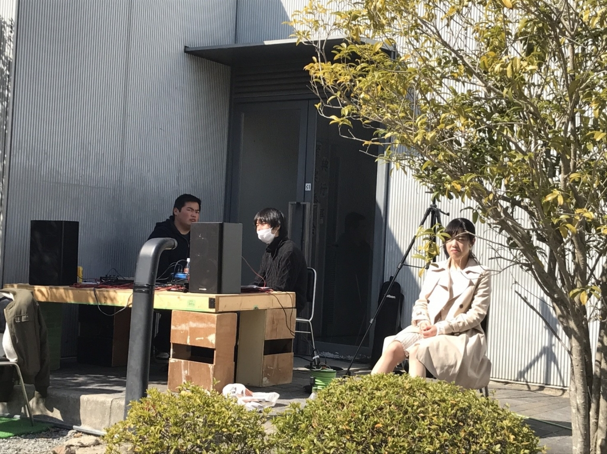

お疲れ様です。

音響チーフのがっしぃです。

今日は第三回通しでした。

それにしても役者の方々は久しい春の日差しの中、本当にお疲れ様です。

　そろそろ全員肌着にすべきですね。特に上着。

いや、これは役者の体調管理のことを思ってですから。多少オペに支障が出る恐れがあります。

　通しの感想ですが……

率直に言うと、台詞がまだ入ってないかなという印象でした。

支障が無い程度なら台詞変えてもいい気がします。僕は「その人」の内にある言葉の方が好きです。

他には

・表現を意識しすぎて会話が変

・感情が急

・動きが小さい

とどれも僕が新発で言われたものばかりですね。

でも声量や滑舌など最低ラインの基礎はほぼ全員出来ているので、流石だなと思いました。大変羨ましい。

今はただ目的意識をもって稽古に望む限りかなと。

本番まで後2週間、まだまだ出来る事はたくさんあるはずです。

自分も初オペ（※前座除外）ですが、舞台全員一丸となって頑張っていきましょう！

[Outlook for Android](https://aka.ms/ghei36) から取得
