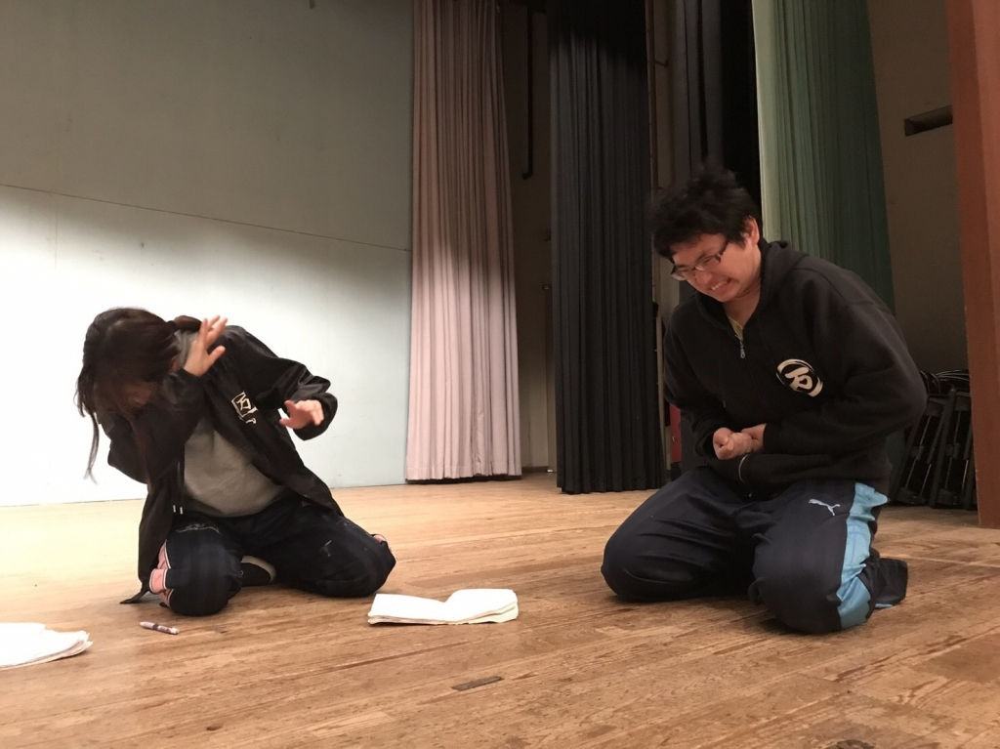

新歓公演までもう2週間を切り、日が進む早さに驚きと焦りを感じる今日この頃。

こんばんは、まるです！

最近気づいたんですけど先輩って神様なんですよ！知ってましたか？
忙しいかったり、しんどかったりするのに僕が「自主練に付き合ってくれませんか？」って言うといつも付き合ってくれて教えてくれるんですよ！本当に感謝しかないです！

先輩というと新歓が終わると僕たち一回生も先輩になるんですねぇ…早すぎる～
今度は自分が新一回生に教えてあげれるように頑張らないと！そのためには新歓中に成長してもっともっと演技が上手くならないとですね！(また自主練やるので、その時はまたよろしくお願いします！)

p.s.写真は自主練に付き合うために自分の身を削っている最中の優しい先輩パズーさんです！
