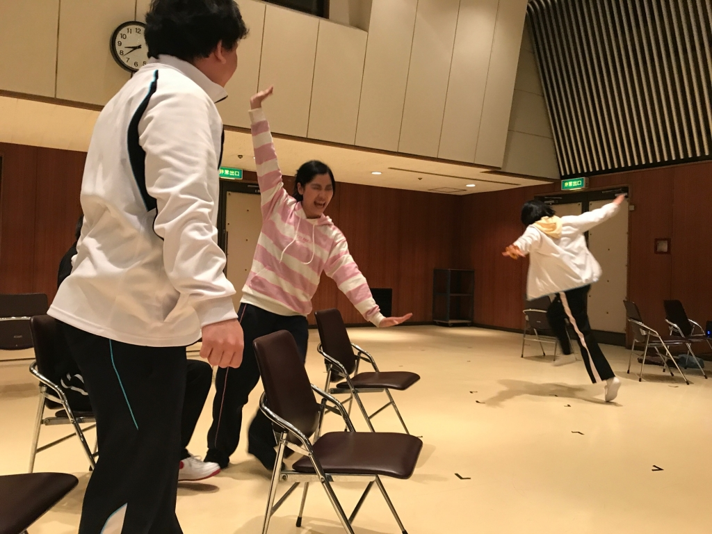

春霞の漂う季節となりました、みなさまいかがお過ごしでしょうか。前回に引き続き新入生歓迎公演でも照明チーフをさせていただきます、1回生マッシュです。
サンマルクカフェのコーヒーチケットを貰ったので嬉々として「高槻 サンマルク」で検索したら予測に「閉店」と出てきました。ドトールもタリーズもスタバもコメダもあるのに！

今日も元気に公民館で稽古でした。練習の成果をシーン回しでお披露目したり、褒められてみんなで喜んだり、上手くいかなくて頭を悩ませたり。こうやって公演が完成されていくんだな～とニヤニヤしてしまいました。

「明日、君を食べるよ」の照明的見どころは、心情の変化です。ホリゾントライトなどを駆使し、キャラクターの気持ちや場の雰囲気によってだんだん照明も変わっていきます。色彩感覚豊かな演出さんと考え抜いた鮮やかな照明プラン、乞うご期待！

ところで、4月1日より万絵巻のツイッターにて『役職紹介』をはじめます。新入生の方も、そうでない方も、バラエティに富んだ様々な役職に興味が惹かれること間違いなしです。お楽しみに！
