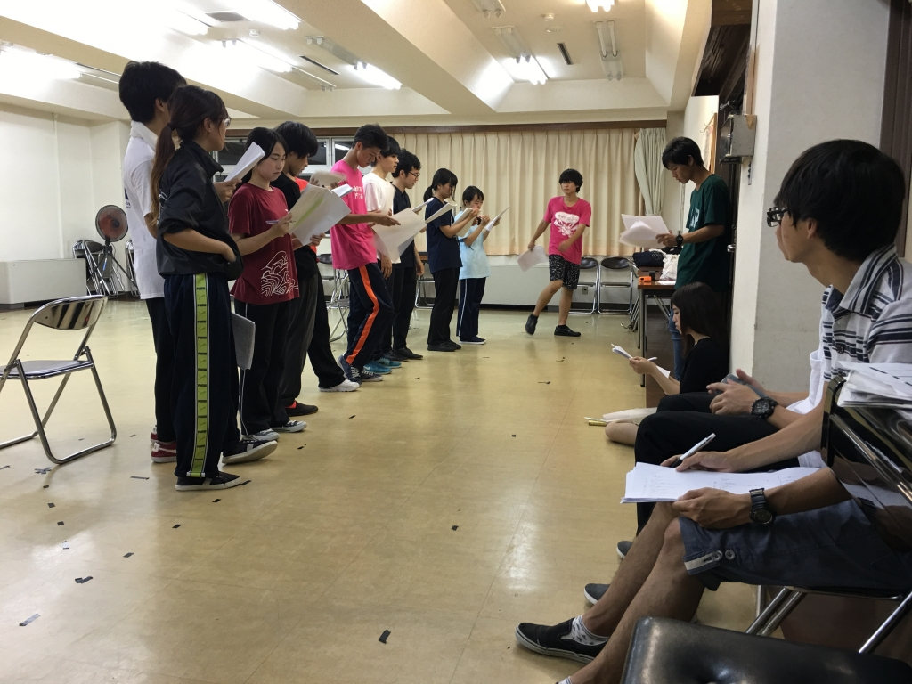

私がブログを任されたのはいつぶりのことだろう。

新入生歓迎公演以来？ つまり……4ヶ月ぶり？

笑笑
記憶にございません、、、

この度、舞台監督を務めさせていただきます、
みかどです。

何書こうかなぁ

と、思いつつ

毎回、最近私が思ったことを
つらつらと書かせていただいてるので
今回もそうします。

近頃、

立派な人というのは、
ちょっとしたことがたくさん違うな

と、思うことがあります。

気配り、

礼儀、

身だしなみ、

人との接し方、

生活態度、

などなど………

それらすべてが少しだけ
人よりきちんとしていて深い。

「有難い」と「あたりまえ」についての話は
推挙にいとまないですが、

「ちょっとしたことが違う」とは
とても大変なことです。

心では「あたりまえ」だと理解していても
できそうで、できません。
続きません。

だからこそ
できる人は本物、なのでしょうね。

とある本で

「人生は、水面下から始まる。
水面下で石を積み重ねている。
そして、少しずつ水面に近づき、
あるとき、パッと景色が変わる。
つまり、水面から目が出たときだ」

みたいなことが書かれていました。

きっと、
その石とは「あたりまえ」のことなのでしょうね。

そろそろ稽古の話をします。

今日初めて稽古に行きました。

まず、始めに思ったこと

新入生、めっちゃ成長しとるばい…
(私は京都生まれ京都育ちです。)

感慨深いものがあります。

あの頃、こんなこと考えてたな

あの頃の自分から何ヶ月たった？

あの頃の自分から何か成長したことある？

あの頃の自分から成し遂げたことはある？

あの頃の自分から………………

などなど……

考えてしまいます、負の連鎖です。

嫌ですね。

自ら鬱期に途中しちょるばい。
(私は京都生まれ京都育ちです)

あと、opも凄いですね。

完成が待ち遠しいです。
