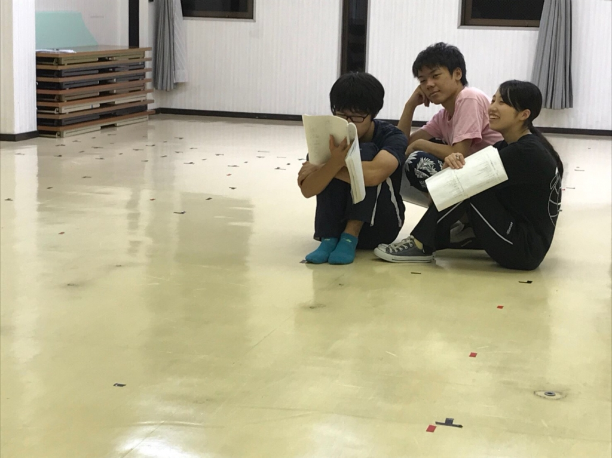

こんにちは。4回生のあおいです。

今回、実は役者をさせていただいております。

4年目にして秋公初出演です。

眩しいシーリングライトを浴びるのは

いつぶりかなと思うとわくわくが止まりません…！

今日は先日の通し稽古を踏まえて、

ではけの確認を入念に行ったり、

作り込みが甘かったシーンを修正したりしました。

課題は沢山あるので、残り少ない稽古時間で

頑張って詰めていきたいなと思いますー！

写真は謎の正方形に入る3人です。

舞台上には沢山のバミテがありますが、

この正方形、一体なんでしょう？

その正体はぜひ当日会場で確かめて

いただけたらなと思います！

いやぁそれにしてもこの正方形とっても狭い…(笑)

今日は19期生の茶髪さんが稽古場に

いらっしゃってくださいました！

ありがとうございます！

最後にブログタイトルについて。

これは司馬遼太郎原作、ドラマ「坂の上の雲」の

主題歌「Stand Alone」に出てくる一節です。

一朶の雲というひとつの目標を目指し、

明治という激動の時代の中で懸命に

突き進んでいた人々の生き様や精神を

表現しているとも言えると思います。

劇団員それぞれが秋公という一朶の雲を目指し、

各々の視点でそれを見つめ、坂を登って作り上げた、

関西大学劇団万絵巻2018年度秋公演

『ひとんちでさよなら』

9/29(土)、9/30(日)は是非、

大阪市立芸術創造館に足をお運びください…！
