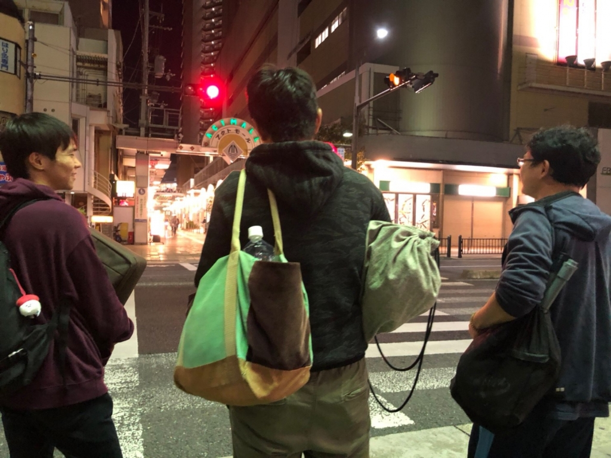

こんばんは。

今日のブログを担当します、三回生の武蔵です。

卒業公演は真っ只中。

演目は「蛮幽鬼」。

個人的に世界観がとても魅力的で、その壮大で超常なストーリーには琴線を鷲掴みにされてます。

だからこそ、今は稽古が純粋に楽しいと感じています。ただ幽玄な世界観に浸るのみでなく、手づから作り上げ表現していくことを目標に精進しますよ！

そして、今日の稽古は劇の筋を確固たるものにせんと少人数で行われてました。

普段じゃなかなか出来ないような、ふんだんに頭と身体、時間を使ったシーン作り。

皆さん、どっと疲れてました！

写真は稽古後、信号待ちをする4回生のお三方。

そこはかとなく何気ないですね。何気なさを感じます。

うん、これはそこはかなにげな良い写真だと思います。

それでは、今後いろいろな形で宣伝もしていきますので、楽しんで見守っていただけると幸いです。
