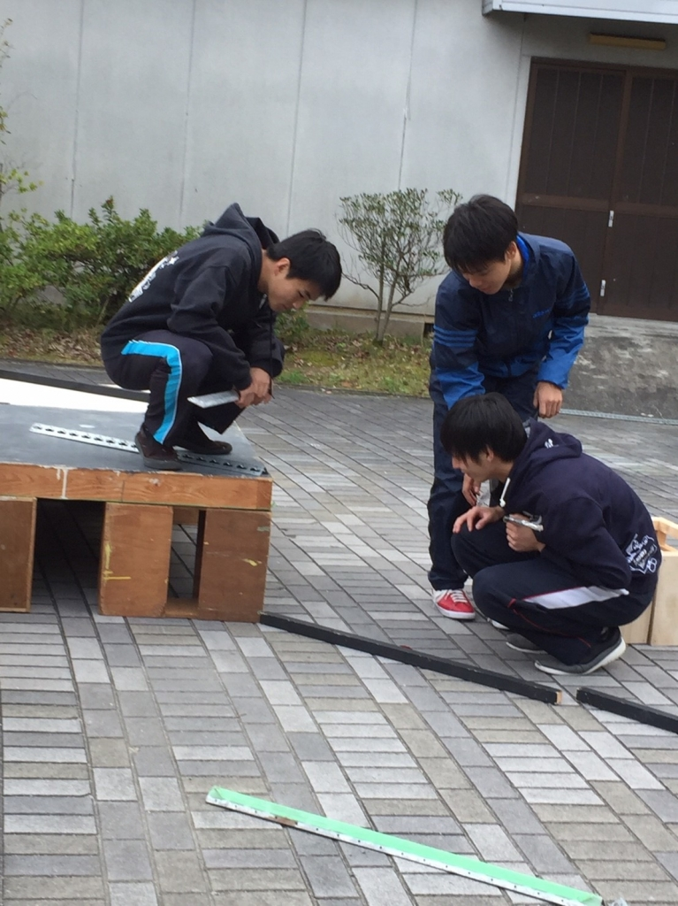

自分らしさってなんだ？

タイトルの由来は「ばらかもん」というアニメの主題歌です。

Suck a Stew Dryの「僕らの自分戦争」も大好きな歌なので皆さん聴いてください。

僕は通称「考えるの大好きマン」です。

前公演の秋公では「自分である意味」

今回の卒公では「自分らしさ」について考えています。

結論を言うと、上記の二曲の歌詞の通りのことを考えてるんですが、すこしは自分の言葉で語りたいと思います。

僕は卒公で所謂モブを担当しています。モブって難しいです。夏秋でようやく演劇を理解し始めて、卒公でいざモブを演じようとしても全然上手くいきません。メインの役は台詞が多いからその分役を考え易いです。それに比べてモブは台詞が少ないからキャラが分からないんですよね。

でもそれは、裏を返せば自由ってことです。だから、モブはその人の個性を特に見せられる場です。そう考えるとモブって素敵な役だと思います。

とは言え、そう簡単に僕のオリジナリティは花開いたりしません。頑張って生み出したオリジナルも他人とそう変わりません。いつまでこれを続けたらいいのかなって不安になりもします。ですが、こうやって努力している間は前に進み続けています。誰かになりたいわけでもない、なれるわけでもない。自分は自分です。だから僕はこの自分戦争、いつ見つかるか分からない自分戦争を続けたいと思います。見つけられるといいなぁ。

これを読んでいる皆さんの中には「そんな当たり前のことを、さも良いことを言った風に言っちゃって(笑)。恥ずかしい奴だな。」と思った人がいるかもしれません。いないかもしれません。僕が考えすぎなのかもしれません。

でもね、それでもね、これが「僕らしさ」だと思うんだよ。

卒業公演、皆さん観に来てください。

