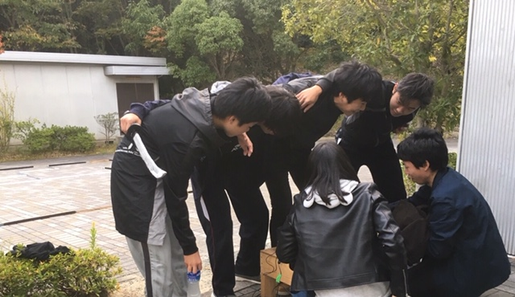

みなさんこんばんは、4回生のDJかおりです。

寒くなってきましたがいかがお過ごしでしょうか。

卒公の稽古も残り2週間を切りました。

もうすぐ終わってしまうという実感があまり湧いて

いない一方で、これが最後という寂しさも感じてい

る今日この頃です。

振り返ればこの4年間、楽しかったこと、嬉しかっ

たこと、悲しかったこと、辛かったこと、いろんな

ことがありました。

私は4年間音響一筋で活動してきて、役者は一度も

経験していません。

同期の中で役者をしていないのは私だけで、

サークルの仲間から「役者しないの？」なんて

冗談交じりに言われることもありました。

役者をしたくなかった訳ではありません。

役者をすることを考えたこともあります。

4年間役者をしないという選択を後悔したことも

あります。

実は「役者しないの？」と聞かれることをちょっ

ぴり辛いと感じていました。

でも、4年間音響として活動する選択をしたことを

後悔したことはありません。

だって、大好きなみんなの演技を特等席で見られる

から。

それだけで私は音響やってて良かったと言えます。

泣いても笑ってもこれが最後の公演。

どうせ泣くなら嬉し泣きがいい。どうせなら笑って

終わりたい。

私自身は表舞台には立ちませんが、音響として役者

を支えることで、先輩や後輩、今まで共に歩んでき

た同期、観に来てくださるお客様に感謝を伝えられ

たらなと思います。

思ったままに書き綴っていたらまとまらなくなって

きましたが、この4年間で先輩から学んだことや自

分の経験を全て出し切れるよう全力を尽くします！

11/30～12/2、芸術創造館にて皆さまのご来場を

お待ちしております！

(写真は殺陣の動画をチェックする殺陣メンツと

音響陣です。殺陣オペがんばるぞー！)
