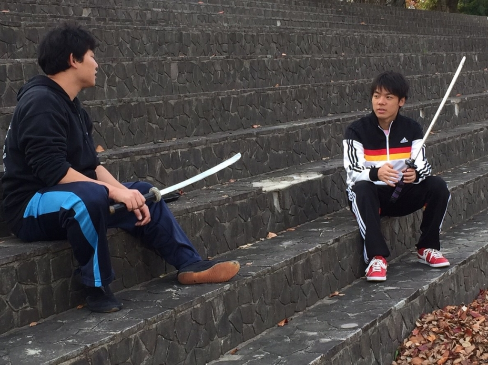

ご飯を食べている時、寝ている時、そこには幸せは感じますが、僕の最高といえるものはめっきり、

大音量の音楽、煌々と照らす照明の下、沢山の拍手が起こっており、数ヶ月を共にした役者が舞台に勢揃いしている…

そんな公演最後のカーテンコールの瞬間です！

どうも、お久しぶりです！パズーです！！！

僕は万絵巻に入り、初めて舞台に上がり、無事にやり終えた。あの瞬間の虜になってしまったんだと思います。

「何かを得たいと考えるならば、それ相応の対価が必要である」

これはまさしくその通りだと思います。

最高な瞬間を得るには最高なものが必要…

役者として役を与えられ、台本を読み込み、自分ではないそのキャラの人生について考え、悩み、自分の中に落とし込み、それを表現する。

その中で共演者とのすり合わせ、演出からのダメ出しが来る。

自分では無い方が良かったのでは？

自分はすぐに心が折れて逃げてしまう弱い人間です。

時に諦め、そこから目を背けてしまう時もありました。

ですが、背けた方を見ると必死で頑張っている同期や後輩の姿が目に飛び込んで来ます。

僕は誰かに支えてもらって今を生きている。

僕が演じる蔵人も同じく悩み、葛藤しもがき苦しみながらも、

己の信じた者を信じ、守り支えていく。

そんな強い思いを持ったかっこいい蔵人も僕を支えてくれていました。

万絵巻はいい意味で僕を逃してくれません。

残り少ないながらも、最高な瞬間のために最高なメンバーで更に最高なものに仕上げていきます！！！！

本番をお楽しみに！！！！！！！
