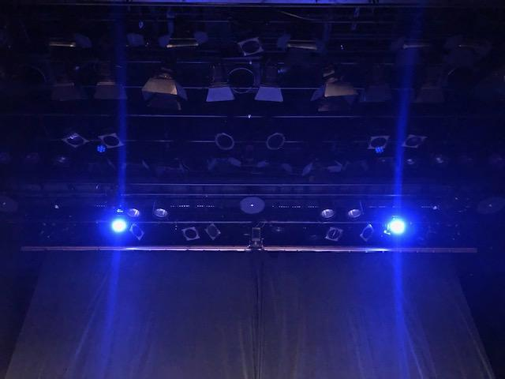

おはようございます。
4回生のジャンヌです！

こうして名前を名乗るものこれで最後になります。
まだまだ実感が湧きません。

今日は少し、私の同期の話をしたいと思います。

2015年、1回生の4月、演劇サークルに入ろうと決めていた私は、万絵巻の活動スペースに行きました。
そこで出会った同期は、クマを背負っていたり、ザ・女子大生だったり、ザ・男子って感じだったり、すでに先輩と仲良くなっていたり……

スーパー人見知りな私は、ウルトラ猫かぶりでコミュニケーションを取ろうとするものの、全く馴染めませんでした。

ですが、一緒に過ごしていくなかで少しずつ慣れていきました。
それはきっと万絵巻を通してたくさん遊んでのびのび演劇をしていたからなんだなと思います。

楽しい嬉しい面白い
辛い苦しい悲しい悔しい
色んな気持ち共有して強くなっていったのかなって。

みんなすごく変なんです。
けど優しいです。
何かしらを抱えて生きていて、
少しひねくれていたりするけど、
すっごく優しいんです。

こうして出会えたのは偶然かもしれない。
けど私はこの人たちに出会えて本当によかった。

『蛮幽鬼』に出会った時、私の同期の最後を飾るのにぴったりな作品だとすぐに思いました。
演出として、みんなの良さを最大限に引き出すことができる配役や演出を必死で考えました。
一方でこの台本を上演して本当にいいのかという葛藤もありました。新感線作品の中でも超有名作で、多くの人にとって大切な作品で。
ですが、通し稽古の度、蛮幽鬼だからこそ私の同期の良さを発揮できると再認識していました。
それは公演を観て実感していただければ幸いです。

今公演で万絵巻を卒業する22期生は私含め11人います。
万絵巻的には人数の少ない学年で、この人数で卒業公演を打つためには1~3回生の力が絶対必要でした。
後輩のみんなも一緒に劇づくりに参加してくれて、彼らの力がなければ絶対に今回の劇を創り上げることはできませんでした。ほんとにありがとう。感謝してもしきれません。

このように活発に活動できる基盤を作ってくださった歴代の先輩方。本当にありがとうございます。
先輩方の背中は大きくて頼もしくて、何度も助けていただきました。

そして観に来てくださるお客様。温かい客席のおかげで役者も楽しく演じることが出来ています。多くのご感想、お褒めのお言葉をありがとうございます。励みになっております。

泣いても笑っても今日で最後！
全力で走り抜きます！

皆さまのご来場、心よりお待ちしております。

ジャンヌ
