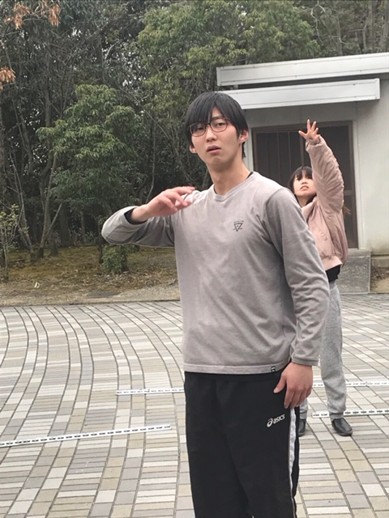

どうもよぉ&#9825;お久しぶり&#9825;筋トレにハマって勢いで最近10キロのダンベルを買ってしまったカジ子よぉ&#9825;

はっ！？僕は一体何を言っているんだ…

最近オカマの実況者にハマってしまってしまった初代(ゴンザレス)です。
先程の失言はもう1人の自分に乗っ取られていたので、忘れてください！！いいですね？
3.2.1で忘れてください！
はい！3.2.1…

よし！忘れましたね！！いいですか？あなたは何も見なかった…いいね？

はい！そんなことは置いといてと、
最近の稽古場ではOPをひたすら作っています。
いやぁOPのダンスがマジでヤバいです笑
激しすぎて太ももがずっと筋肉痛状態…
毎日OP練習をするからeveryday筋肉痛ですw
けれどもダンスが激しいので、毎日やってたら結構痩せれるかも？？
OPのダンスをすることによって、ダンスが上手くなるのと、筋肉痛によって筋肉がつくのと、あと痩せることができる…
練習をすればするほどWIN WINですね！！
最高じゃないですかぁ！

写真はイケメン1回生のサンちゃんとそのスタンドの\[フォーミュラー・ワン・スズカ\]です。

\[スタンド名\]フォーミュラ・ワン・スズカ
破壊力E スピードE 射程距離A 持続力E
精密動作性B 成長性A
