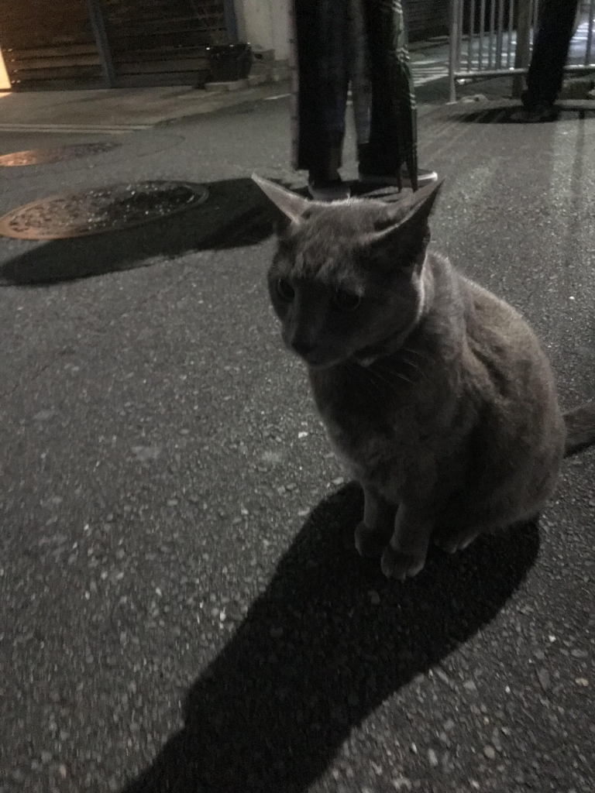

どうも、おはこんばんちわ
お久しぶりです、ノンベジ・JK・花夏流です。
もとい、終夜です。名前変えてるのは理由がありますー
今回はですねーなんと！！新入生歓迎公演の演出をすることになりました！
実に約1年ぶりの演出でございます！一つ前の公演では演出補佐でしたけどね！
と、今回の公演の話を致しましょう！

タイトルの通り今回の舞台は猫が関連している？！猫の舞台と言えばあの某有名劇団のミュージカル？！？！
とまぁ色々予想したのではないでしょうか！
はい、そんな有名舞台は致しません…残念かもしれませんが。
今回はなんと！創作台本でございます！
いやー万絵巻では久々の創作です、ちなみに書いてるのは僕です。だから名前変えて見ました。はい。
といってもまぁ元々ある有名的な文学作品を軸に繰り広がる物語です。
さて、文学作品で猫が関わる話と言えば何かと聞かれればいっぱいあります。まぁなんなら大して関わってません。アニメ化した時に猫になりました。
そう、「草稿 銀河鉄道の夜」です、それを再編成して作りましたのが「創稿 銀河鉄道の夜」です！
幸せについて考えまくった話です！生きる上で人は幸せになりたいと誰だって考えたことがあるでしょう？これから生きていくみなさんに幸せについて見直して貰えれないいと思います書きました、だから是非、観劇しにきてください！新入生も他の人も待ってます！

そして最後にタイトルの伏線回収でございますが、写真でございまする！今日の稽古場に猫がいたんですーー舞台に立ちたくて稽古しにきたんですかねーーー！！！可愛いい…一度でいいからほんとに猫と共演して見たい。
この子人懐っこいんですよ、ほんといや可愛いなぁ
