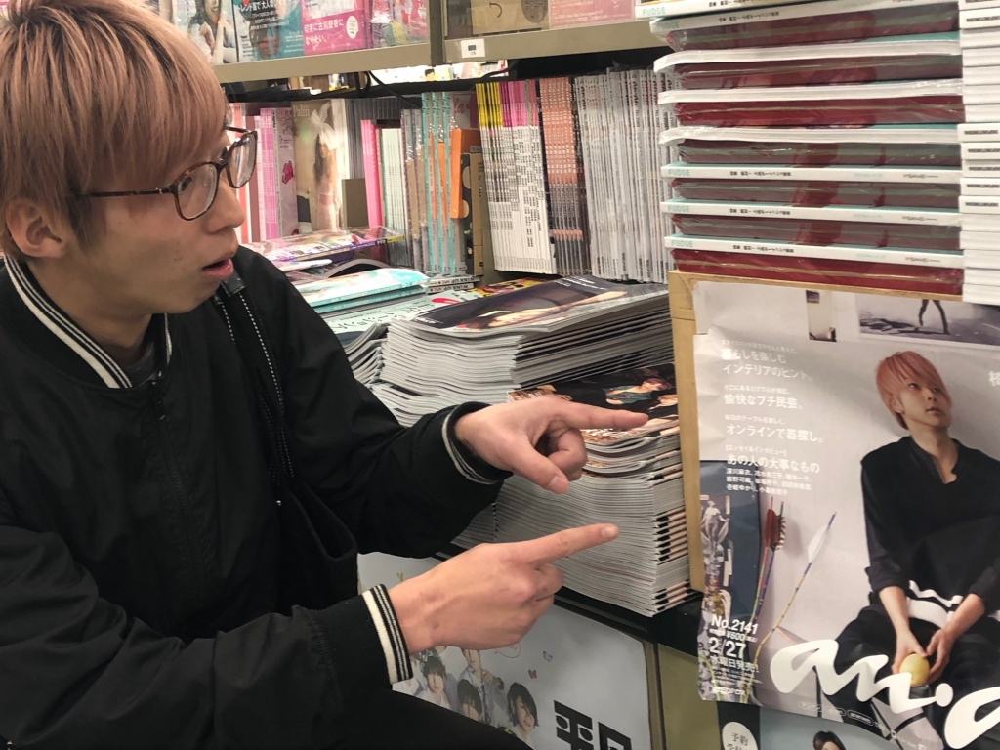

ラギトです！3回生です！

3回生か～、3回生はな～

実は僕今回の高槻キャンパス祭公演でまるまる一年間稽古場にいたことになるんですよね～！

よく頑張った！

…そろそろ休憩したいところなんですけど、まだまだ役者やり足りないのでこれからも忙しくなりそうです。1年間役者やり続けても課題は腐る程ありますし！！

もともと去年に僕がここに入団した時は裏方メインで、役者なんて以ての外って思ってたんですけど人生何があるかわからないものです。

それはさておき、このブログ指名されたのが4/30ということで実は平成最後の日なんですよ！びっくりや。

ひとつの年号の最後にブログ指名されるなんてなんかありがてぇ～！

うぉぉぉぉ、平成最後のブログ！

でも平成が終わってしまうのは少し寂しいですね。成人したり、三回生になったり、自分の生まれた年号が終わったりと最近 ここまで年を取ってしまったんやな～ってよく感じる場面あります、、、！

うぉぉぉぉ、平成最後のセンチメンタル！

これからさらに年を取って、次の年号の令和が終わる直前に「その前の元号だった平成が終わる直前は一体何してたんだろう」って考えるんでしょうね！その時にこの劇団に入って学生生活を満喫してたって想い出が蘇ってセンチメンタルな気分になるんでしょうね～

うぉぉぉぉ、平成最後のみらいよち！

今日は

21期生の夜王さん、マキさん

22期生のベルさん

が遊びに来て下さいました、ありがとうございます！お三方に演技指導していただいて感謝です！！

うぉぉぉぉ、平成最後の先輩の訪問！

あ、ついでに今日はうちいりでした！

うおおおぉおおぉぉぉ、平成最後の晩御飯はカレーだ！！！
