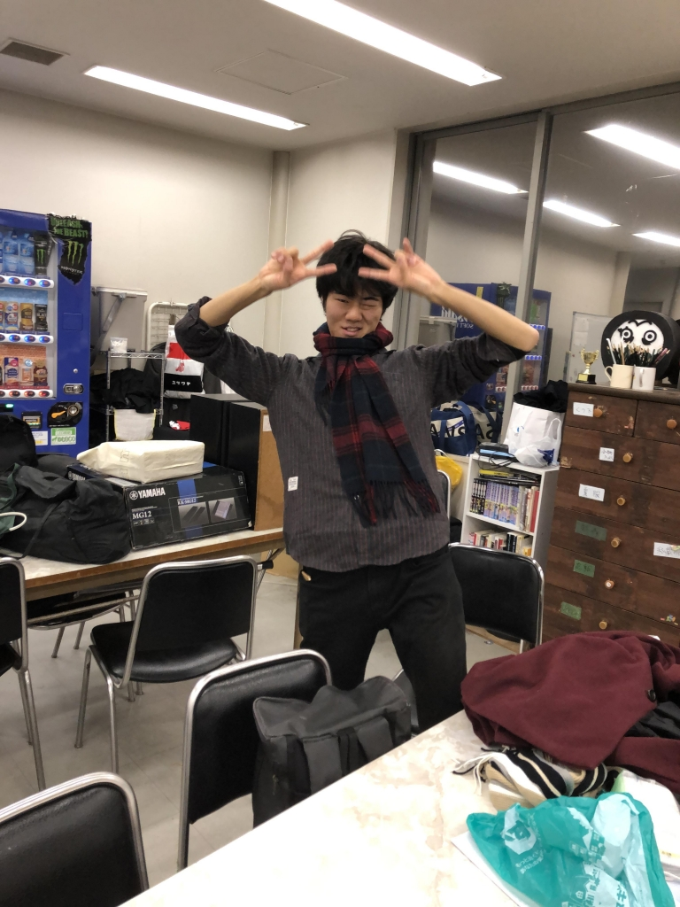

お久しぶりです。胡蝶です。
ブログを書くのは夏公ぶりになります。いやー、何を書けばいいのやら…

とりあえず稽古の感想を書こうと思います。

寒いですね。ひたすらに寒い。

Ｓ棟で話し合う日もあれば、外でひたすらガヤの練習の日もあり、後者の場合はカイロ必須です。
ガヤで喉をやられる+乾燥+寒さでいつ風邪をひくかヒヤヒヤしています。
みなさんも風邪には気をつけてください。インフルエンザの季節でもありますからね！

卒公まであと1週間きってしまいましたが、まだ動きが微妙なところが沢山ある(一番の問題は表情)ので徐々に矯正していきたいと思います！
銃を撃つ動きって難しいですよね。
タイトルの通り腕に柔軟性が欲しいところです。

ちなみに写真はブログに載せるものに困っていた時、快く写真を提供してくれたラギトさんです。感謝。
