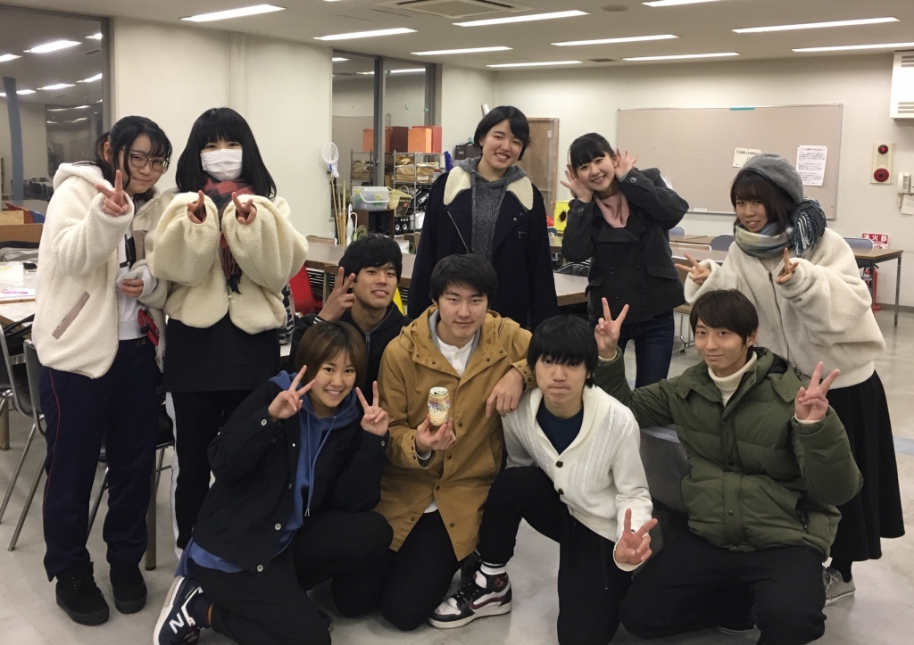

卒公が終わってしまって結構経ちましたね、新発の稽古が始まっております！！爆速！！！

ということで今公演の演出を務めさせていただきます、書記です。よろしくお願いします。

この間は荒通しでした。稽古は毎日楽しいながらも不安で一杯です。本当に毎日すごい緊張しながら稽古をしています…！

急に苦手の話になるんですけど、
私は周りの人間より何倍も何倍も考え無しです。先を見通すのが死ぬほど苦手です。
私が演劇が好きな理由の1つがこれです。演劇って終わりが既に決まってるんですよね。当たり前ですけど。何をしたらいいか、どう進んでいくか、初めから決まってる訳です。どう寄り道しても結局絶対筋から外れることは無い、その安心感が心地好くて私は演劇を好きでいます。

考え無しで、自主的に動くのが苦手で、人の目ばっかり気にする私が、先を見通さなきゃいけなくて、自主的に動いて、自分のやりたいことを表現しなければいけない演出をなぜやるのか。それは演出をやることで人として強くなりたいからです。
勿論同期や2回生の先輩と舞台を創りたいという気持ちも大きいですが、私という人間をもっとマシな人間にしたい そんな動機があって今回演出に立候補しました。
こんな動機で結局私欲じゃないかって思われるかもしれないですね。半分私欲です、ごめんなさい。
でも私が強くなったらもっと万絵巻や皆に貢献できると思うんです、んんんけどこれは言い訳になんないか…

「演出」という仕事は高校で1年演劇をしていたというものの全くやった事なくて(部員皆でダメ出しし合う形でした)、右も左も分かりません。なんなら前も後ろも分かんないです。笑 演補にまだまだ頼りっきりですがこのままじゃいけないなとつくづく思います。

スタートは切ってしまってます。もう後戻り出来ないです。気を引き締めて、気合いいれてこの2ヶ月間死ぬ気でやってやろうと思います。長生きする気なんてハナからないんで、これで死んじゃってもいいですね！そんな感じできしょめ重めのブログになってしまいましたがこのへんで。

2ヶ月後ブログ書く時にはちゃんと成長してるように努力します。

皆見てて！！！あとついてきて！！！！！成長してみせるから！！！！！！！

関西大学劇団万絵巻2019年度新人発表公演
『月並みなはなし』
台本：黒澤世莉
演出・潤色：書記
演出補佐：ヤッキー・D
【日時】
2020年
2月22日(土)、2月23日(日)
【会場】
茨木市立男女共生センターローズWAM地下2階ワムホール
【料金】
無料
