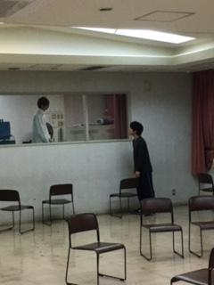

お疲れ様です、ナダルです
先ず一言
酒は控えましょう

つい昨日、と言うか今日でもありますが、ついつい酒に呑まれてしまいました。
酒というのは良いものです。心身を弛緩させ普段溜めてしまいがちな凝りを禊いでくれます。喉を焼くアルコールは心地よい火照りとともに、羽化登仙といった具合で思考を酩酊へと誘ってくれる。
しかし、人は自身の限界を知るべきであり、そう言ったことから見ると昨夜の自分はあまりにやり過ぎた。大道具には本当に申し訳ないことをしました。酔い潰れたせいで作業にも支障が出てしまいましたから。まあ自業自得ではあるのでしょう、罰は甘んじて受けねばなりません。

話は変わりますが、今日はやたらと演出と演補に遊ばれていたように思います。

越後製菓はやり過ぎでは？

写真の題名は『未知との遭遇、或いは無菌室の彼ら』
でどうでしょうか
