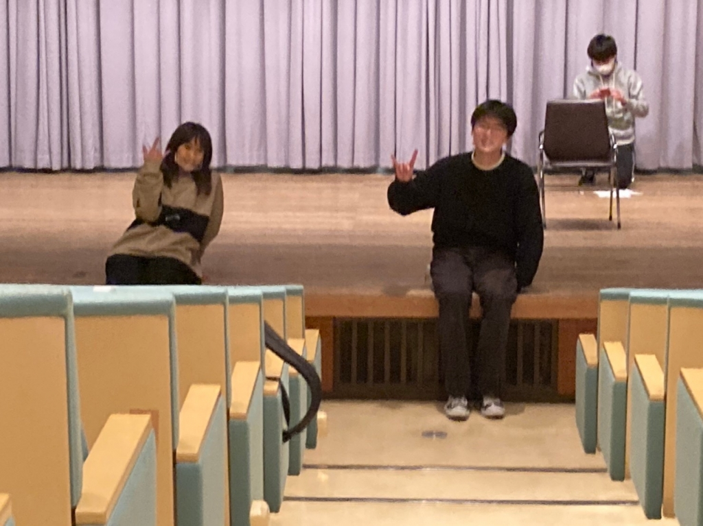

どうもだりやです。

稽古は対面になってもしっかり感染症対策を行なっています！両親のアルバムを見たぐらいの感じを覚える写真があったので載せますね．
個人的にはポーズのダサさが昭和みを演出してるんですかね。
いつか書いたのですが花粉が辛いですね。
目を掻きすぎてまいにち目があいていません。
演出から長めにブログを書けと言われたので
今回は長めに真面目ながら適当に書こうと思っています。
タイトルは僕の座右の銘です。
スペイン語の諺なんですが、座右の銘です！なんて紹介してるところが自分で絶妙に痛いなあと感じますね。
意味は

「何事を始めるのにも
　　　　　　　遅過ぎると言うことはない」

的な感じだったと思います。スペイン語が堪能な人間ではないで深い意味は知りません。
いつかのブログに書きましたが自分はとても気分屋な人間なのです。毎月毎週毎日毎時間毎秒ごとに気分が変わるのです。放っておくと厄介な人間になってしまいます。知らない人とか自分と距離の遠い人間の前だとしっかり気を張って気をつけようと思えるのですが親しい人間には案外隠し通しきれません。だからすぐ情緒不安定とかいわれるんですね。ほんとご迷惑を申し訳ない。こんなことを書こうとしたわけではなかったですね。
話を戻します。気分屋の僕にとって新しいことに挑戦するというのはとてもよくあることで、小学校の頃に友達に喧嘩に負けて悔しくて空手を始めたり、同級生のめちゃくちゃかっこいいプレーをみてバドミントンを始めてみたり
ゲーム実況者に憧れて動画を投稿してみたり
いろんなことを急に興味を持って始めることが多かったのです。
しかし冷めるのも早いんですよね。
バドミントンは6年続けましたがそれ以外は1年続きませんでした。
気づけば僕の手元に特別な技術はありません。
実に平凡な人間であるというのを痛感させられるのです。
ある日そんな僕が演劇に興味を持ってしまいました。舞台に立って自分で表現できる人間になりたいと思ってしまいました。
２回生からの中途半端な時期からの入団、コロナウイルスでの活動休止でスタートダッシュもうまくきれず、同期と呼ばれる人たちは大学初めでも自分よりも1年間多く演劇というものを体験してきているしもっと前から演劇に力を注いで生きてきた人もいます。
もっと早くこの世界を知れていたら、ポテンシャルを感じられない自分の成長にせめてもっと前から時間をかけていれたら、後悔しても何もプラスの方向には進まないのは分かりきっているのですが考え込んでしまいます。全部全部誰が悪いとかではなく仕方がないことなのです。純粋に尊敬できる人間に囲まれている幸せがちっぽけな自分の存在を際立たせるのです。卑屈ですね。
憧れとは厄介なもので頭から離れないんですよね。それもどんどん増えていく。
苦しくなった時にこの諺が頼りない僕を支えてくれるんです。本当に助かりますね。
頑張るしかないのです。足りない能力は人より時間をかけて補っていくしかないのです。センスなんてもんは持ち合わせていません。人より時間と熱量をかけるだけのやる気は十分あると信じています。自分に大きな期待はできませんがやれるだけやってみます。
マイナス思考や悩みを書くと病んでるとか精神の脆弱性が高過ぎると言われてしまうのですが今回だけ書いてみました。
これから打てるかもしれない公演はTCも夏も秋も卒も全部楽しみで仕方ありません。
悩む時間は無駄なのは知っているのでここに全部置いていきます。もう悩みません。
後悔しないことなんて絶対できないですが
後悔の数を減らすため全力疾走したいと思います。自分への宣戦布告ですね。

てかよく見たらイタイですね。
このブログダサいですね。
もう成人だっていうのに幼いですなー。
まあ、卒団まで楽しむってことでした。
最後まで読んだ人は変人ですね。
また今度ー
